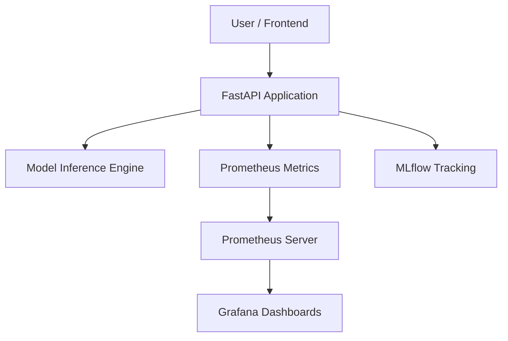

# System Architecture

## Overview
The Sentiment Analysis Service is designed as a containerized microservice that provides real-time and batch sentiment analysis with model explainability.

## Component Diagram


## Tech Stack
- **Backend:** FastAPI (Python 3.11)
- **Model Engine:** PyTorch / Transformers
- **Containerization:** Docker & Docker Compose
- **Monitoring:** Prometheus & Grafana
- **Tracking:** MLflow
- **CI/CD:** GitHub Actions

## Data Flow
1. User sends a POST request to `/predict` or `/explain`.
2. FastAPI validates the request using Pydantic schemas.
3. The request is passed to the `ModelInference` class.
4. Model results are returned and formatted.
5. Metrics (latency, status codes) are recorded via Prometheus middleware.
6. The final response is returned to the user.

## Deployment
The entire stack can be deployed using:
```bash
docker-compose up --build
```
