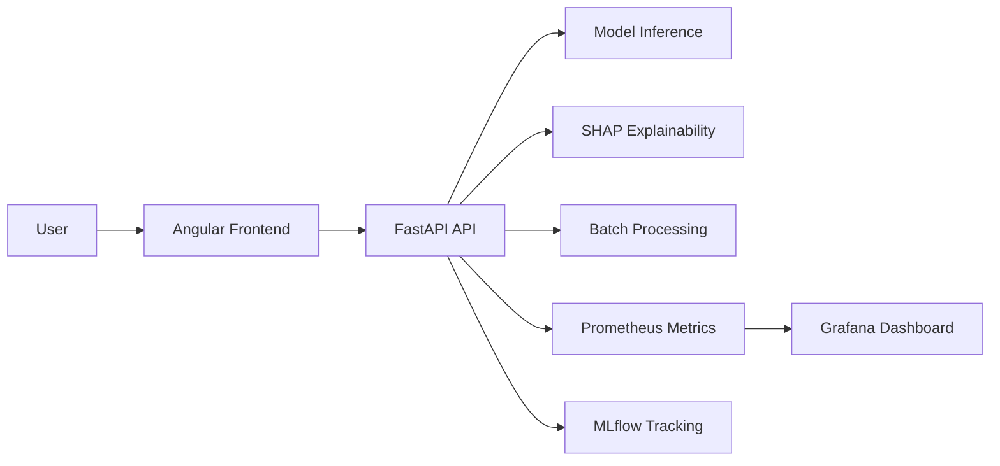
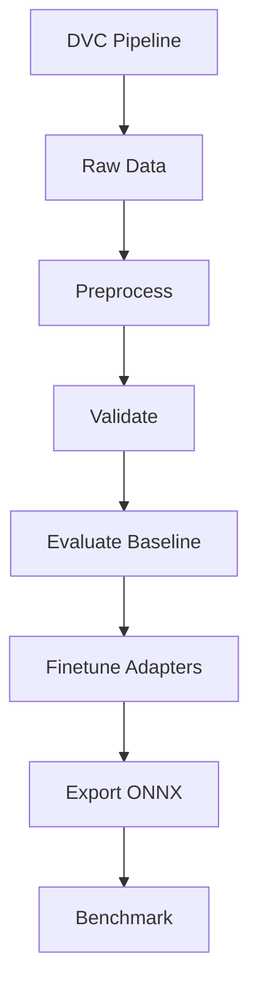
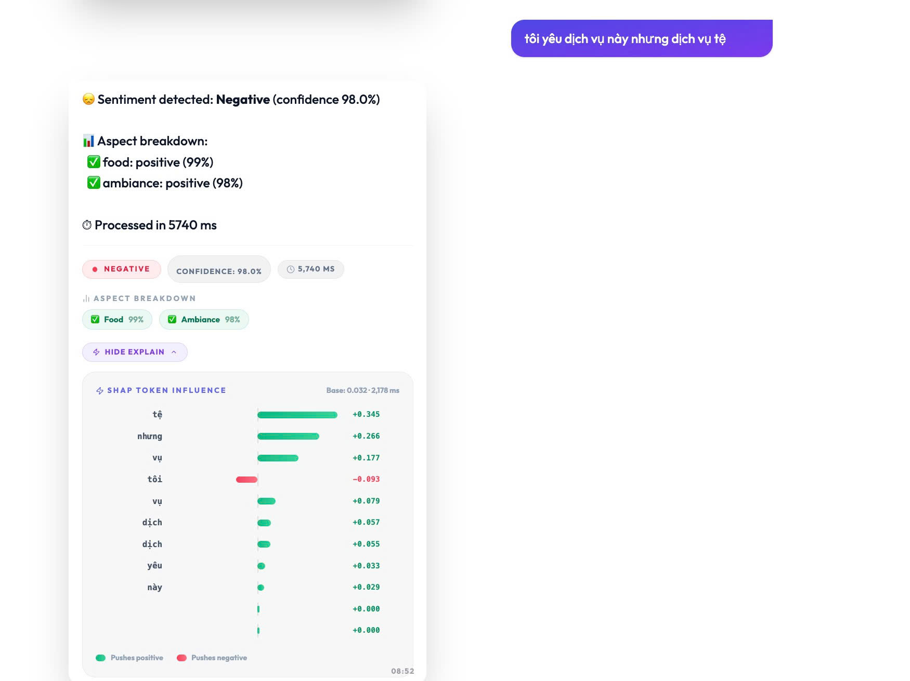
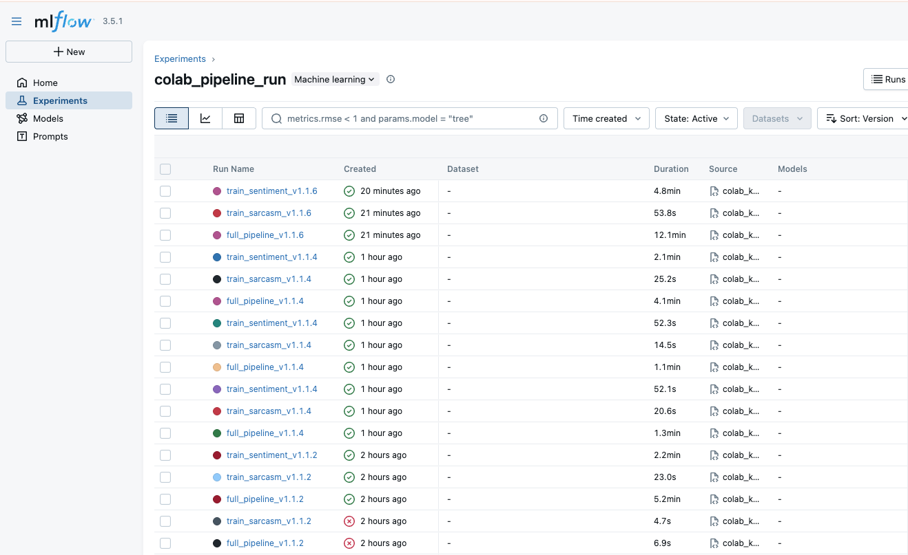
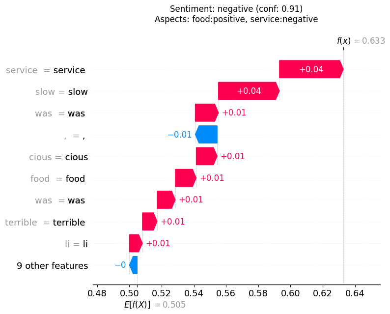
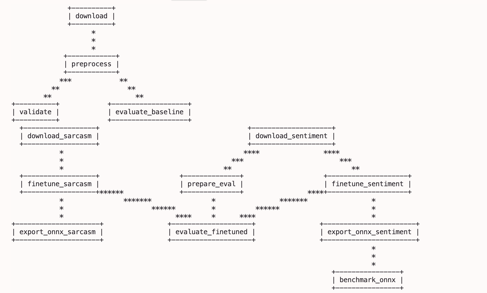
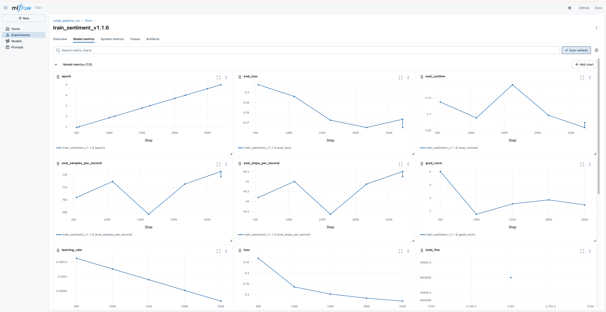
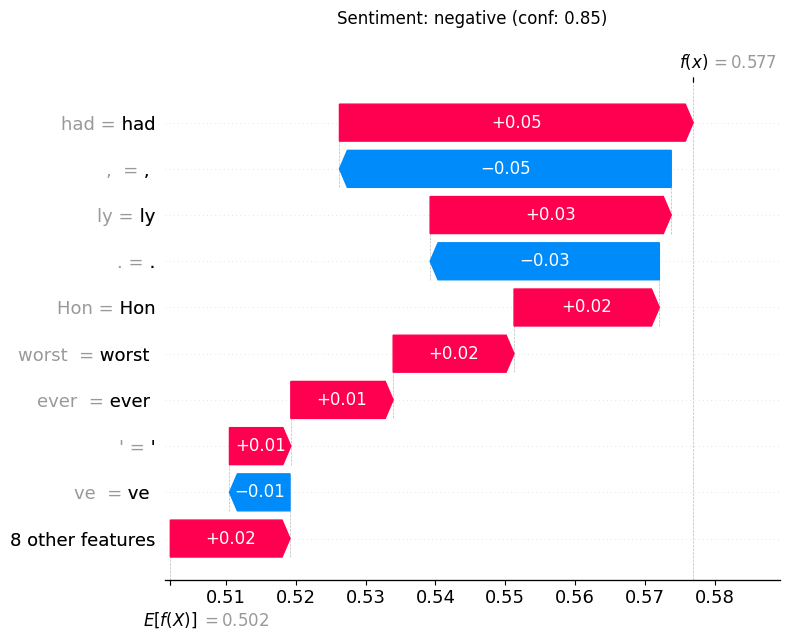
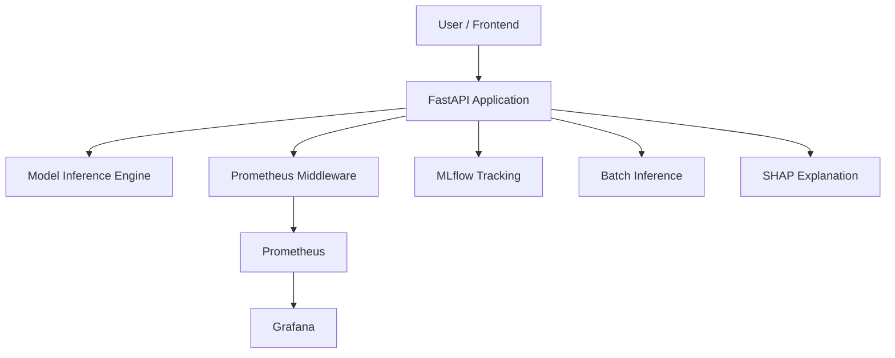

# Sentiment Analysis Service

[](https://www.python.org/downloads/)
[](https://fastapi.tiangolo.com/)
[](https://docs.docker.com/)
[](https://dvc.org/)
[](https://mlflow.org/)
[](./docs/final_project_report.pdf)

Production-oriented sentiment analysis platform with:

- real-time sentiment classification
- aspect-based sentiment analysis
- sarcasm detection
- SHAP explainability
- batch CSV inference
- finetuning and ONNX export pipelines
- Prometheus and Grafana observability
- Angular frontend
- DVC-managed data workflow

This repository implements the backend service, model training utilities, monitoring stack, and frontend client for an end-to-end NLP system.

## At A Glance

| Area | What It Covers |
|---|---|
| Core API | `POST /predict`, `POST /explain`, `POST /batch_predict`, `GET /health`, `GET /metrics` |
| Model modes | `baseline`, `finetuned`, `onnx`, `onnx_int8` |
| Tasks | sentiment classification, ABSA, sarcasm detection, explainability |
| Data flow | DVC download → preprocess → validate → evaluate → export |
| Ops stack | Docker Compose, MLflow, Prometheus, Grafana |
| UI | Angular chatbot-style frontend |

## Start Here

| If you want to... | Go to... |
|---|---|
| run the full stack | [Deployment](#deployment) |
| inspect API payloads | [API Reference](#api-reference) |
| reproduce the pipeline | [DVC Pipeline](#dvc-pipeline) |
| review model behavior | [Responsible AI](#responsible-ai) |
| follow the report structure | [Report Structure](#report-structure) |

## Visual Overview





## Demo Screenshots

| API demo | Observability |
|---|---|
|  |  |
|  |  |

## Architecture Gallery

These assets document the implementation and experiment flow across the project.

| MLflow run detail | DVC pipeline | Prediction output |
|---|---|---|
|  |  |  |

## Key Results

These numbers are recorded in the final report artifacts and should be read as repository-evidenced results, not universal guarantees.

| Result | Value | Context |
|---|---:|---|
| Baseline accuracy | `0.8135` | SemEval test-set evaluation on `799` samples |
| Baseline macro F1 | `0.7389` | Same baseline test-set run |
| Fine-tuned overall F1 | `0.7926` | Sampled evaluation artifact from the finetuned run |
| English F1 | `0.7892` | Fairness report |
| Vietnamese F1 | `0.7335` | Fairness report |
| ONNX INT8 throughput | `321.39 samples/s` | Benchmark artifact |
| ONNX INT8 avg latency | `3.1115 s` | Benchmark artifact |
| Processed data rows | `3,831` | Data-quality validation report |

## Report-Aligned Highlights

- End-to-end system from data ingestion to deployment
- Explicit ABSA output for restaurant-domain reviews
- SHAP explainability for token-level interpretation
- Multilingual runtime gate for English and Vietnamese
- Evaluation, fairness, and benchmarking artifacts checked into the repository
- Multi-service deployment with monitoring and experiment tracking
- Appendix G team ownership reflected in `CONTRIBUTING.md`

## Table of Contents

- [Project Summary](#project-summary)
- [Problem Statement](#problem-statement)
- [Goals](#goals)
- [Requirements and Success Metrics](#requirements-and-success-metrics)
- [System Overview](#system-overview)
- [Architecture](#architecture)
- [Technology Choices](#technology-choices)
- [Demo Screenshots](#demo-screenshots)
- [Architecture Gallery](#architecture-gallery)
- [Start Here](#start-here)
- [Data and Datasets](#data-and-datasets)
- [Model Design](#model-design)
- [API Reference](#api-reference)
- [DVC Pipeline](#dvc-pipeline)
- [Training and Export](#training-and-export)
- [Monitoring and Metrics](#monitoring-and-metrics)
- [Responsible AI](#responsible-ai)
- [Deployment](#deployment)
- [Frontend](#frontend)
- [Testing](#testing)
- [Setup Guide](#setup-guide)
- [Project Structure](#project-structure)
- [Team Responsibilities](#team-responsibilities)
- [Known Limitations](#known-limitations)

## Project Summary

The system exposes a FastAPI service that predicts sentiment for a single text, explains predictions with SHAP, processes CSV batches, and supports evaluation against prepared datasets. The service can run in multiple model modes:

- `onnx` - default inference path
- `onnx_int8` - quantized ONNX inference
- `finetuned` - LoRA adapters stacked on `xlm-roberta-base`
- `baseline` - Hugging Face RoBERTa classifier

The repository also includes:

- a DVC pipeline for reproducible data preparation and evaluation
- a training pipeline for sarcasm and sentiment adapters
- Prometheus metrics and Grafana dashboards
- an Angular UI for interacting with the API

## Design Principles

- stateless request handling
- typed request and response contracts
- reproducible data and model workflows
- practical explainability instead of black-box inference
- deployment-first structure with Docker and Compose
- report-backed metrics and artifacts for evaluation

## Problem Statement

Sentiment analysis in production is not just a classification problem. A usable system must:

- accept text from users or files
- return low-latency predictions
- support multilingual input
- explain its predictions
- scale to batch jobs
- provide observability for operations
- support model iteration and evaluation

This project addresses those requirements with a containerized microservice architecture that combines NLP inference, data versioning, monitoring, and deployment tooling.

## Goals

The implementation targets the following practical outcomes:

- provide a stable API for real-time sentiment prediction
- extract aspect-level sentiment for restaurant-style review text
- detect sarcasm using a dedicated adapter when available
- offer model explanations for individual predictions
- run batch inference over CSV inputs
- support baseline, ONNX, and finetuned inference paths
- track metrics and errors through Prometheus and Grafana
- keep training and evaluation reproducible through DVC and MLflow

## Requirements and Success Metrics

### Functional Requirements

- single-text prediction through `POST /predict`
- ABSA returned alongside the overall sentiment label
- CSV batch inference through `POST /batch_predict`
- model explanations through `POST /explain`
- health checks for readiness probing
- metrics exposure for observability
- background evaluation with MLflow logging
- frontend access for end users

### Non-Functional Requirements

- low latency for single-request inference
- reproducible data and training pipelines
- containerized deployment
- observable runtime behavior
- maintainable typed Python codebase
- test coverage across core layers

### Success Metrics

- sentiment classification and ABSA performance should be tracked on held-out evaluation data
- request latency should remain practical for single-text inference
- batch processing should remain stable for moderate file uploads
- Prometheus and Grafana should expose request and inference telemetry
- MLflow should capture training and evaluation runs

These metrics are intended as operational guidance for the project rather than fixed contractual guarantees.

## System Overview

The service is organized around a single FastAPI application that orchestrates request validation, language detection, model inference, SHAP explainability, and metrics collection.



Request flow:

1. The client sends a request to `/predict`, `/explain`, or `/batch_predict`.
2. FastAPI validates the payload using Pydantic schemas.
3. The service resolves the language, or uses the caller-provided `lang`.
4. The model layer performs sentiment inference.
5. Optional ABSA extraction and sarcasm detection are added when available.
6. The response is returned and request metrics are exported to Prometheus.

## Architecture

### Backend

The API entrypoint is [`src/main.py`](./src/main.py). It defines:

- startup model loading via FastAPI lifespan hooks
- CORS configuration
- exception handlers
- prediction, explanation, batch, evaluation, and metrics endpoints
- Prometheus middleware integration

### Model Layer

The main implementation is [`src/model/baseline.py`](./src/model/baseline.py), which supports:

- Hugging Face sentiment classification
- ONNX inference sessions
- optional sentiment and sarcasm adapters
- zero-shot ABSA via a DeBERTa classifier
- SHAP explanations for token-level attribution

### Data Layer

The data pipeline is implemented in:

- [`src/data/downloader.py`](./src/data/downloader.py)
- [`src/data/pipeline.py`](./src/data/pipeline.py)
- [`src/data/validators.py`](./src/data/validators.py)

### Training Layer

The finetuning stack is implemented in:

- [`src/scripts/run_finetuning.py`](./src/scripts/run_finetuning.py)
- [`src/training/`](./src/training/)
- [`src/scripts/export_onnx.py`](./src/scripts/export_onnx.py)
- [`src/scripts/evaluate_finetuned.py`](./src/scripts/evaluate_finetuned.py)

### Monitoring Layer

Operational metrics live in [`src/monitoring/metrics.py`](./src/monitoring/metrics.py) and are surfaced through Prometheus-compatible output.

## Report Structure

The final report in [`docs/final_project_report.pdf`](./docs/final_project_report.pdf) documents the same system from an academic perspective:

- problem definition and requirements
- architecture and technology trade-offs
- ML pipeline and deployment
- monitoring and CI/CD
- responsible AI, fairness, and privacy
- documentation and appendix material

The README keeps that structure, but presents it in a shorter, product-facing format.

## Technology Choices

The project makes the following implementation trade-offs:

- `FastAPI` over Flask for typed request validation, automatic OpenAPI docs, and async-friendly endpoints
- `Docker Compose` over Kubernetes for a simpler local-first deployment workflow
- `MLflow` for experiment tracking because it is lightweight and self-hostable
- `DVC` for reproducible data stages and artifact tracking
- `Prometheus` plus `Grafana` for standard metrics scraping and dashboards
- `ONNX Runtime` for faster inference options when exported model artifacts are available
- `Angular` for the frontend because the project already ships a dedicated browser client

## Data and Datasets

The repository uses multiple datasets depending on the task:

- `SemEval-2014 Restaurant` data for ABSA-style restaurant reviews
- multilingual sentiment data for English and Vietnamese sentiment classification
- `tweet_eval` irony data for sarcasm detection
- manually curated Vietnamese sarcasm probe rows for evaluation

The active data parameters are defined in [`params.yaml`](./params.yaml):

- dataset name: `semeval2014_restaurants`
- supported splits: `train`, `test`
- validation ratio: `0.1`
- split seed: `42`
- max text length: `2000`

### Preprocessing Rules

The preprocessing pipeline applies:

- lowercasing
- whitespace trimming
- duplicate removal
- conflict label dropping
- minimum text length filtering
- sentiment derivation using a `negative_priority` strategy
- aspect label normalization, including mapping `ambience` to `ambiance`

### Validation Rules

The validation step checks:

- minimum sample count
- null ratio thresholds
- expected sentiment labels
- expected aspect labels

## Model Design

### Inference Modes

The runtime mode is selected with `MODEL_MODE`.

- `baseline`
  - loads `cardiffnlp/twitter-roberta-base-sentiment-latest`
  - uses Hugging Face classification directly
- `finetuned`
  - loads `xlm-roberta-base`
  - applies sentiment and sarcasm LoRA adapters
- `onnx`
  - loads `models/onnx/sentiment_fp32/model.onnx`
  - may also load a sarcasm ONNX sibling if available
- `onnx_int8`
  - loads `models/onnx/sentiment_int8/model_quantized.onnx`

### Language Support

Supported languages are:

- `en`
- `vi`

If the client omits `lang`, the service runs language detection first and records the detected language in the response.

### Sentiment Output

The primary sentiment labels are:

- `negative`
- `neutral`
- `positive`

### ABSA

The ABSA path uses zero-shot classification over these categories:

- `food`
- `service`
- `ambiance`
- `price`
- `location`
- `general`

If aspect extraction fails or the model is unavailable, the service falls back to an empty aspect list rather than failing the entire request.

### Sarcasm Detection

Sarcasm detection is integrated into the inference stack and is exposed as `sarcasm_flag` in sentiment responses. In finetuned mode, a dedicated sarcasm adapter is loaded alongside the sentiment adapter.

### Explainability

The `/explain` endpoint returns SHAP token attributions for the predicted class. The response includes:

- tokens
- SHAP values
- base value
- request latency

## API Reference

### `GET /health`

Returns model readiness and supported languages.

Response fields:

- `status`
- `model_loaded`
- `version`
- `supported_languages`

### `POST /predict`

Single-text sentiment inference with optional ABSA and sarcasm detection.

Request body:

- `text` - required string, 1 to 2000 characters
- `lang` - optional language code

Response fields:

- `text`
- `sentiment`
- `confidence`
- `aspects`
- `sarcasm_flag`
- `detected_lang`
- `lang_confidence`
- `latency_ms`

Example:

```json
{
  "text": "The food was amazing but the service was slow.",
  "lang": "en"
}
```

### `POST /explain`

Returns token-level SHAP values for the given text.

Response fields:

- `tokens`
- `shap_values`
- `base_value`
- `latency_ms`

### `POST /batch_predict`

Uploads a CSV file with a `text` column and returns row-by-row sentiment predictions.

Behavior:

- up to 500 rows are processed per request
- empty rows are marked as failed
- ABSA is skipped in batch mode to keep runtime acceptable on CPU

Response fields:

- `total_items`
- `processed_items`
- `failed_items`
- `latency_ms`
- `results`

Each result item includes:

- `row`
- `text`
- `sentiment`
- `confidence`
- `aspects`
- `error`

### `POST /evaluate`

Triggers background evaluation against `data/processed/sentences.csv` and logs metrics to MLflow.

### `GET /evaluate/status`

Returns the evaluation worker state:

- `running`
- `last_run`
- `last_error`

### `GET /batch_status/{job_id}`

Returns a mocked completed status object for batch tracking.

### `GET /metrics`

Returns Prometheus-formatted service metrics.

## DVC Pipeline

The reproducible pipeline is defined in [`dvc.yaml`](./dvc.yaml).

### Stages

1. `download`
   - extracts SemEval XML files into `data/raw/sentences.csv` and `data/raw/aspects.csv`
2. `preprocess`
   - applies text cleaning, label mapping, and splitting into `data/processed/`
3. `validate`
   - generates `data/reports/quality_report.json`
4. `evaluate_baseline`
   - evaluates the baseline model and writes `data/reports/baseline_metrics.json`
5. `download_sarcasm`
   - downloads the sarcasm dataset
6. `download_sentiment`
   - downloads English and Vietnamese sentiment datasets
7. `prepare_eval`
   - builds `data/eval/mixed_lang_eval.csv` and `data/eval/vi_sarcasm_eval.csv`
8. `finetune_sarcasm`
   - trains the sarcasm adapter
9. `finetune_sentiment`
   - trains the sentiment adapter
10. `evaluate_finetuned`
   - produces finetuned evaluation reports
11. `export_onnx_sentiment`
   - exports sentiment ONNX artifacts
12. `export_onnx_sarcasm`
   - exports sarcasm ONNX artifacts
13. `benchmark_onnx`
   - benchmarks the exported sentiment model

Run the pipeline with:

```bash
dvc repro
```

## Training and Export

### Finetuning

The finetuning CLI is [`src/scripts/run_finetuning.py`](./src/scripts/run_finetuning.py).

Supported tasks:

- `sentiment`
- `sarcasm`

Examples:

```bash
python -m src.scripts.run_finetuning --task sentiment
python -m src.scripts.run_finetuning --task sarcasm --smoke
```

Training configuration is task-specific:

- sentiment uses multilingual sentiment data and can oversample the minority class
- sarcasm uses irony data with class weighting

Artifacts are written under:

- `models/adapters/sentiment/`
- `models/adapters/sarcasm/`
- `models/adapters_smoke/` for smoke runs

### Evaluation Preparation

[`src/scripts/prepare_eval.py`](./src/scripts/prepare_eval.py) produces:

- `data/eval/mixed_lang_eval.csv`
- `data/eval/vi_sarcasm_eval.csv`

### ONNX Export

ONNX export scripts build both fp32 and int8 model variants for inference benchmarking and runtime deployment.

## Monitoring and Metrics

### Prometheus

The service exports request and inference metrics through Prometheus middleware.

Typical metric categories include:

- request counts
- request latency
- model inference latency

### Grafana

The Docker Compose stack includes Grafana provisioning through `infra/grafana/provisioning/`.

### MLflow

MLflow is used for:

- data preprocessing experiments
- baseline evaluation
- finetuning runs
- parameter and metric tracking

### Generated Artifacts

The repository includes outputs that support the report narrative:

- `images/mlflow_dashboard.png` for experiment tracking visibility
- `images/dvc_flow.png` for pipeline visualization
- `images/sample_1_pred-negative_aspects-food_service.png` for ABSA output
- `images/sample_3_pred-negative.png` for classification output
- `docs/final_project_report.pdf` for the formal write-up

## Responsible AI

The repository includes explainability and operational safeguards that support responsible deployment:

- `/explain` exposes SHAP-based token attributions for individual predictions
- the model layer keeps inference stateless and avoids persisting user text in the API layer
- the monitoring stack focuses on aggregate request and latency telemetry rather than payload logging
- the evaluation workflow supports separate checks for multilingual sentiment and Vietnamese sarcasm probe data
- the report includes fairness tracking across English and Vietnamese evaluation slices

Known limitations remain:

- the primary sentiment model is pretrained on social-media style text, so domain shift can affect performance
- sarcasm handling depends on whether a sarcasm adapter or ONNX model is available
- batch mode intentionally skips ABSA to avoid a large CPU latency penalty

## Deployment

### Docker Compose

Bring up the full stack with:

```bash
docker compose up --build
```

Services:

- API: `http://localhost:8000`
- Swagger UI: `http://localhost:8000/docs`
- ReDoc: `http://localhost:8000/redoc`
- Frontend: `http://localhost:80`
- Prometheus: `http://localhost:9091`
- Grafana: `http://localhost:3000`
- MLflow: `http://localhost:5005`

Grafana default credentials:

- username: `admin`
- password: `admin`

### Runtime Configuration

Set the model mode before startup:

```powershell
$env:MODEL_MODE = "onnx_int8"
```

```bash
export MODEL_MODE=onnx_int8
```

The compose file also configures resource limits for the API, frontend, Prometheus, Grafana, MLflow, and optional training service.

## Frontend

The Angular client lives in [`app/sentiment-analysis-chatbot/`](./app/sentiment-analysis-chatbot/).

Local development:

```bash
cd app/sentiment-analysis-chatbot
npm install
npm start
```

Production build:

```bash
npm run build
```

The frontend is designed to connect to the backend API and present real-time sentiment results in a browser UI.

## Testing

Run the backend tests with:

```bash
pytest --cov=src tests/
```

The repository also supports targeted test execution:

```bash
pytest tests/
```

The current test strategy includes:

- unit tests for data transforms and training helpers
- integration tests for FastAPI endpoints
- model validation checks for output schema and runtime behavior
- data validation checks for processed datasets

## Setup Guide

### 1. Clone the repository

```bash
git clone <repo-url>
cd Sentiment-Analysis-Service
```

### 2. Create a Python environment

```bash
python -m venv .venv
.venv\Scripts\activate
```

### 3. Install backend dependencies

```bash
pip install -r requirements.txt
```

### 4. Prepare model artifacts

Use the runtime mode you need:

- `baseline` for the Hugging Face classifier
- `finetuned` for LoRA adapters under `models/adapters/`
- `onnx` or `onnx_int8` for exported ONNX artifacts

### 5. Run the API

```bash
uvicorn src.main:app --reload --host 0.0.0.0 --port 8000
```

### 6. Optional: run the full stack

```bash
docker compose up --build
```

### 7. Optional: run the pipeline

```bash
dvc repro
```

## Project Structure

```text
Sentiment-Analysis-Service/
├── app/
│   └── sentiment-analysis-chatbot/   # Angular frontend
├── contracts/                        # Shared request/response schemas and interfaces
├── data/                             # Raw, processed, eval data managed by DVC
├── docs/                             # Architecture notes and project reports
├── infra/                            # Prometheus and Grafana config
├── models/                           # Adapters and exported ONNX artifacts
├── src/                              # API, model, training, monitoring, scripts
├── tests/                            # pytest suite
├── Dockerfile                        # API image
├── Dockerfile.train                  # Training image
├── docker-compose.yml                # Full stack orchestration
├── dvc.yaml                          # Reproducible pipeline
├── params.yaml                       # Data and training parameters
└── requirements.txt                  # Python dependencies
```

## Team Responsibilities

The original project plan divides the work into three tracks:

- AI core and modeling
- backend, DevOps, and MLOps
- frontend, documentation, and reporting

In practical repository terms, that maps to:

- `src/model/`, `src/training/`, and `src/scripts/` for model work
- `src/main.py`, `docker-compose.yml`, `infra/`, and `tests/` for backend and operations
- `app/sentiment-analysis-chatbot/` and `docs/` for the frontend and documentation

### Report and Presentation Notes

For the report, slides, and demo narration, the following ownership split is the most useful reference:

- Dương Binh An
  - ML pipeline and dataset narrative
  - model evaluation, benchmarking, and optimization sections
  - DVC and MLflow explanation
  - supporting plots, tables, and technical model write-up
- Dương Hồng Quân
  - system architecture and solution design narrative
  - deployment and monitoring sections
  - observability, integration, and runtime flow explanation
  - demo flow and cross-service coordination slides

If you are updating report-facing content, keep those names consistent with Appendix G in [`docs/final_project_report.tex`](./docs/final_project_report.tex).

## Known Limitations

- `GET /batch_status/{job_id}` is currently mocked rather than backed by a persistent job queue.
- Batch inference skips ABSA to avoid high CPU latency.
- The service depends on available model artifacts for ONNX and finetuned modes.
- If those artifacts are absent, use `baseline` or regenerate the models through the training pipeline.
