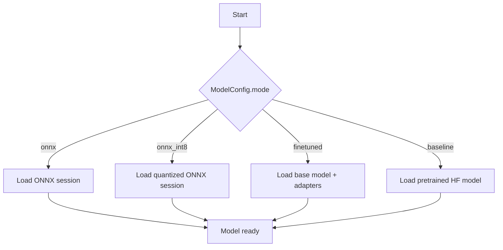
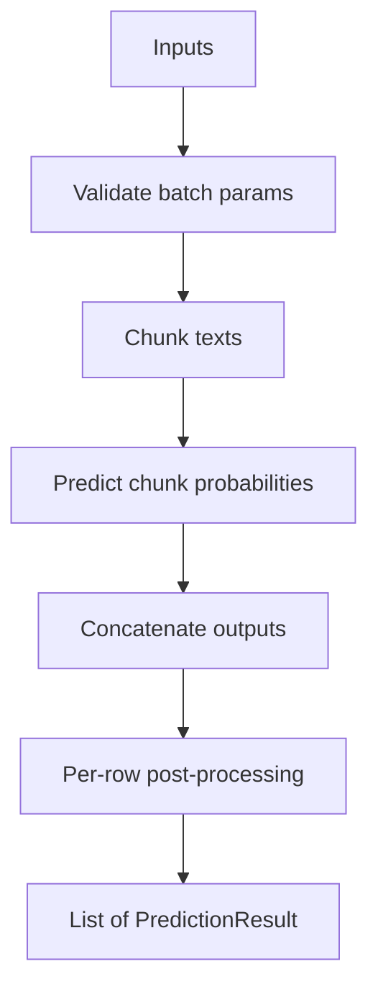
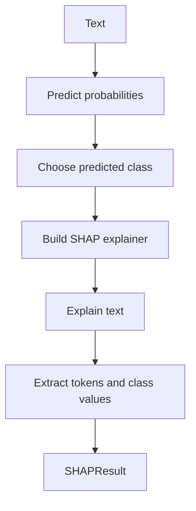
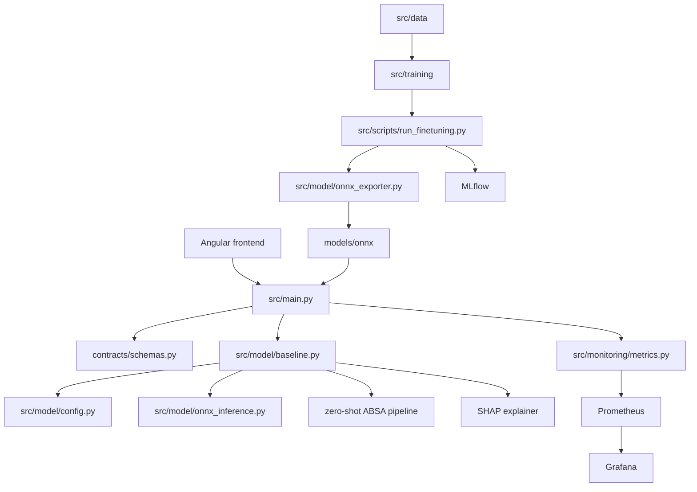
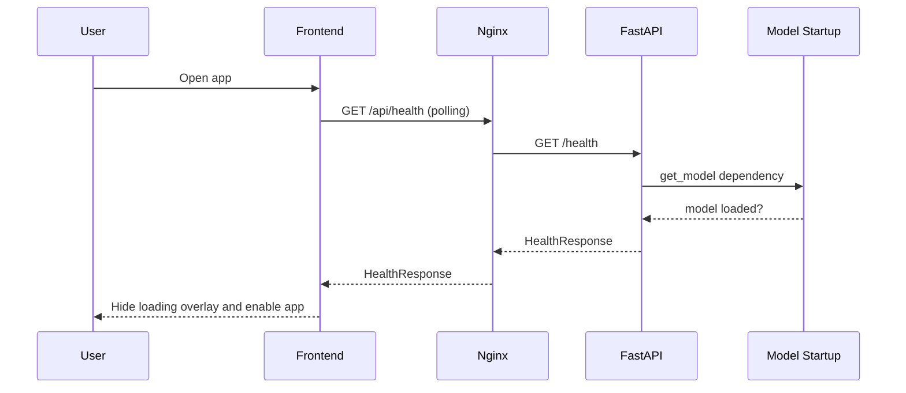
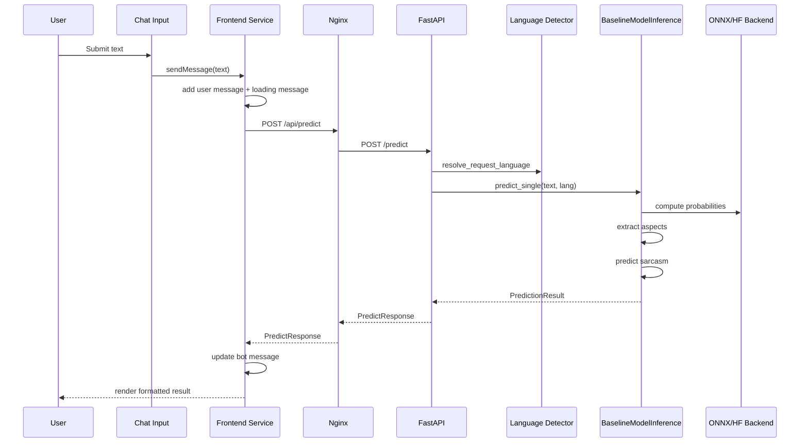
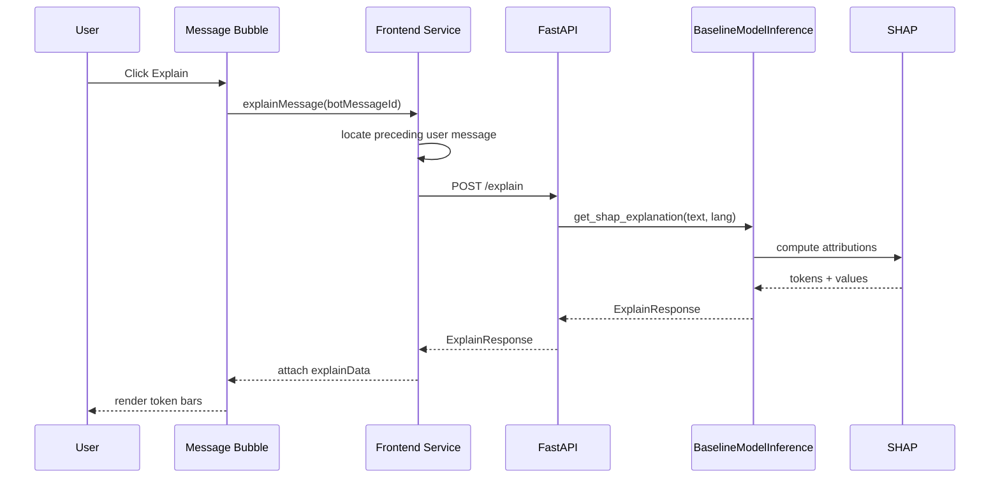
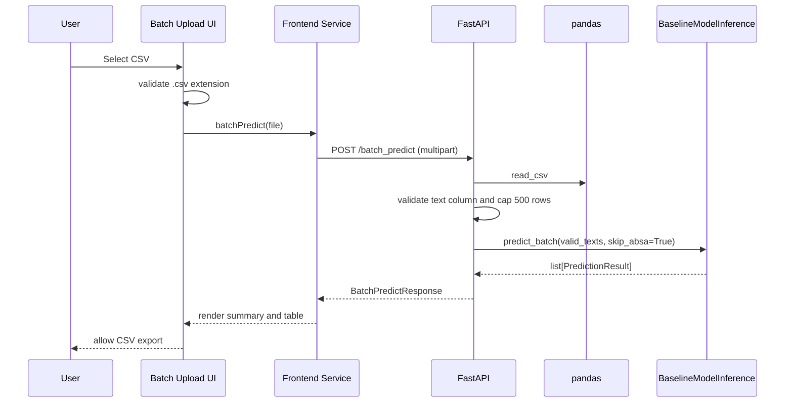
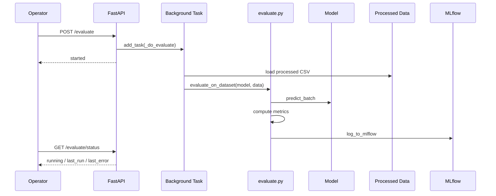

# Sentiment Analysis Service
## Complete Technical Dossier

Date: 2026-06-04  
Repository: `/home/andb/Documents/Sentiment-Analysis-Service`  
Primary evidence sources:

- source code under `src/`, `contracts/`, and `app/`
- runtime configuration under `docker-compose.yml`, `Dockerfile`, `Dockerfile.train`, `params.yaml`, `dvc.yaml`
- tests under `tests/`
- documentation used last and treated as secondary evidence

Method:

- implementation first
- configuration second
- tests third
- docs last

If implementation and documentation disagree, this report trusts the implementation and calls out the mismatch explicitly.

---

## Part 1 - Project Purpose

Evidence anchors:

- frontend user actions: `app/sentiment-analysis-chatbot/src/app/app.component.ts:246-279`
- explain and batch UX: `app/sentiment-analysis-chatbot/src/app/services/sentiment-analysis.service.ts:99-147`
- backend API surface: `src/main.py:96-299`

### Non-technical explanation

### What is this project?

This project is a full-stack sentiment analysis application.

It lets a user:

- type text into a web UI
- receive a sentiment prediction
- see aspect-level sentiment
- request token-level explanation
- upload a CSV file for bulk prediction

It also contains the internal ML workflow that:

- downloads data
- preprocesses data
- trains models
- evaluates models
- exports ONNX artifacts
- tracks experiments

### What problem does it solve?

It turns raw text into structured sentiment signals that are easier to use operationally.

Examples:

- customer review analysis
- feedback triage
- service issue diagnosis
- explainable AI demonstrations
- batch analysis of many text rows

### Who uses it?

- end users using the frontend demo
- backend engineers extending the API
- ML engineers training and exporting models
- maintainers running the stack locally
- reviewers evaluating the project as an end-to-end ML system

### What can a user actually do?

Based on the live frontend implementation in `app/sentiment-analysis-chatbot/src/app/app.component.ts` and related components:

- wait for backend readiness through health polling
- send a single text for analysis
- view sentiment, confidence, aspects, sarcasm flag, and latency
- click Explain to request SHAP token influence
- upload a CSV file and receive row-by-row batch predictions
- export batch results to CSV
- clear local chat history

### What happens when the project is running?

Simple analogy:

- the frontend is the dashboard
- Nginx is the reception desk routing requests
- FastAPI is the control room
- the model inference layer is the brain
- DVC and MLflow are the lab notebook and experiment bench
- Prometheus and Grafana are the monitoring screens

### Technical explanation

Technically, this repository combines one user-facing inference application and one offline ML artifact-production pipeline.

The online path is:

- Angular frontend
- Nginx reverse proxy
- FastAPI backend
- `BaselineModelInference` runtime

The offline path is:

- DVC stage orchestration
- raw data download
- preprocessing and validation
- LoRA finetuning
- evaluation and MLflow logging
- ONNX export for runtime serving

Business success is measured through a mix of product and engineering signals:

- prediction quality and stability
- end-user latency on `/predict`
- batch throughput for CSV upload flows
- explainability availability through `/explain`
- reproducibility of data/training/evaluation stages
- operability through Prometheus, Grafana, and MLflow

---


## Part 2 - Complete System Mental Model

Evidence anchors:

- runtime entrypoint and routes: `src/main.py:31-299`
- inference engine: `src/model/baseline.py:34-407`
- offline pipeline graph: `dvc.yaml:1-163`

### Executive Mental Model

This repository actually contains two related systems:

1. an online user-facing inference system
2. an offline ML artifact-production system

The online system serves predictions.
The offline system creates the artifacts that make those predictions possible.

```mermaid
flowchart TD
    User --> Frontend[Angular Frontend]
    Frontend --> Nginx[Nginx Reverse Proxy]
    Nginx --> API[FastAPI API]
    API --> Model[BaselineModelInference]
    Model --> Runtime[ONNX / HF Runtime]
    Model --> ABSA[Zero-shot ABSA]
    Model --> SHAP[SHAP Explainer]
    API --> Metrics[/metrics]
    Metrics --> Prometheus[Prometheus]
    Prometheus --> Grafana[Grafana]
    API --> Eval[/evaluate]
    Eval --> MLflow[MLflow]

    RawData[Raw Data] --> Preprocess[Preprocessing Pipeline]
    Preprocess --> Processed[Processed Data]
    Processed --> Train[Training Pipeline]
    Train --> Adapters[LoRA Adapters]
    Adapters --> Export[ONNX Export]
    Export --> Runtime
```

### Engineering Mental Model

- User-facing layer: Angular app under `app/sentiment-analysis-chatbot/src/app/`
- API layer: FastAPI app in `src/main.py`
- Model layer: inference code in `src/model/baseline.py`
- Data pipeline: data prep under `src/data/`
- Training pipeline: finetuning under `src/scripts/run_finetuning.py` and `src/training/`
- Monitoring layer: metrics in `src/monitoring/metrics.py`, infra in `infra/`
- Deployment layer: Docker and Compose in root files

### Infrastructure Mental Model

From an operations perspective, the running system is a small container stack:

- one frontend container serving Angular through Nginx
- one FastAPI backend container serving inference
- one Prometheus container scraping metrics
- one Grafana container visualizing runtime health
- one MLflow container storing experiment metadata
- one optional trainer container for offline model work

The critical operational fact is that the backend is both the request-serving process and the model-hosting process. If the backend fails to start or load artifacts, the whole product path is unavailable.

### ML Mental Model

From an ML perspective, the repository separates model creation from model serving:

- raw data is downloaded and normalized
- processed datasets feed training and evaluation
- LoRA adapters are trained for sentiment and sarcasm
- adapters are exported into ONNX artifacts
- the backend loads either baseline HF weights, finetuned adapters, or ONNX runtime sessions

This means the runtime model is not the training code itself. The runtime consumes artifacts that the offline pipeline produces.

---


## Part 3 - Architecture Deep Dive

Evidence anchors:

- backend startup and middleware: `src/main.py:31-78`
- ONNX runtime bridge: `src/model/onnx_inference.py:7-40`
- Compose topology: `docker-compose.yml:2-134`

### User architecture

- actor: browser user
- actions: send text, request explanation, upload CSV, export CSV
- startup behavior: waits for health polling
- failure mode: UI stays blocked if backend readiness never succeeds

### Frontend architecture

- shell: `AppComponent`
- state/service layer: `SentimentAnalysisService`
- input layer: `ChatInputComponent`
- result view: `MessageBubbleComponent`
- batch UI: `BatchUploadComponent`

### Backend architecture

- entrypoint: `src/main.py`
- dependencies: `get_model()`, request schemas, monitoring middleware
- responsibilities: validation, language resolution, response shaping, background evaluation kickoff

### Model architecture

- abstraction: `ModelInference`
- concrete runtime: `BaselineModelInference`
- backends: HF baseline, PEFT finetuned, ONNX runtime
- auxiliary analysis: ABSA, sarcasm, SHAP

### Training architecture

- DVC orchestrates offline stages
- `src/scripts/run_finetuning.py` drives adapter training
- `src/scripts/evaluate_finetuned.py` evaluates adapters
- `src/model/onnx_exporter.py` creates runtime artifacts

### Monitoring architecture

- app middleware emits request metrics
- `/metrics` exposes Prometheus format
- Prometheus scrapes backend
- Grafana provisions dashboards and alert views

### Deployment architecture

- `docker-compose.yml` wires frontend, backend, Prometheus, Grafana, MLflow, and trainer profile
- `Dockerfile` packages backend runtime with offline artifacts
- frontend Nginx proxies `/api/*` to FastAPI

### Actual runtime components

- frontend: Angular app
- reverse proxy: Nginx
- backend API: FastAPI
- model service: `BaselineModelInference`
- model backends:
  - ONNX Runtime
  - Transformers/PyTorch
  - PEFT adapters in finetuned mode
- monitoring:
  - Prometheus
  - Grafana
- experiment tracking:
  - MLflow

### Runtime architecture diagram

```mermaid
flowchart LR
    User --> FE[Angular Frontend]
    FE --> NX[Nginx]
    NX --> API[FastAPI]
    API --> LANG[Language Detector]
    API --> INF[BaselineModelInference]
    INF --> ONNX[ONNX Runtime Session]
    INF --> HF[Transformers Model]
    INF --> ABSA[ABSA Pipeline]
    INF --> SHAP[SHAP]
    API --> METRICS[/metrics]
    METRICS --> PROM[Prometheus]
    PROM --> GRAF[Grafana]
    API --> EVAL[/evaluate]
    EVAL --> DATA[data/processed]
    EVAL --> MLFLOW[MLflow]
```

### Classification

This is best classified as:

- containerized ML application
- service-oriented full-stack application
- modular single backend service

It is **not**:

- a microservice estate
- a queue-driven async platform
- a database-centric business system

Why:

- there is one main backend process in `src/main.py`
- there is no broker, queue, or event bus
- there is no persistent application database
- the support services are operational add-ons, not business microservices

Evidence:

- backend entrypoint: `src/main.py`
- service topology: `docker-compose.yml`
- no DB library or ORM found in runtime code

---


## Part 4 - Repository Reverse Engineering

Evidence anchors:

- root runtime topology: `docker-compose.yml:2-134`
- backend package layout: `src/main.py:31-299`, `src/model/baseline.py:34-407`
- frontend package layout: `app/sentiment-analysis-chatbot/src/app/app.component.ts:246-279`

| Folder | Purpose | Runtime Critical? | Read Priority | Notes |
| ------ | ------- | ----------------- | ------------- | ----- |
| `app/` | Angular frontend | Yes | Early | user-facing layer |
| `contracts/` | API schemas, errors, inference interface | Yes | Early | shared contract boundary |
| `src/` | backend and ML logic | Yes | Earliest | main implementation |
| `src/data/` | dataset download, preprocess, validation | No | Later | offline ML path |
| `src/model/` | model loading, inference, evaluation | Yes | Earliest | most important ML runtime code |
| `src/monitoring/` | Prometheus metrics middleware | Yes | Early | observability |
| `src/scripts/` | CLI tasks for training/export/benchmark | No | Later | operational tooling |
| `src/training/` | reusable training helpers | No | Later | offline finetuning path |
| `data/` | raw/processed data and data reports | Partially | Later | artifact storage |
| `models/` | adapters and ONNX artifacts | Yes | Early | serving dependency |
| `infra/` | Prometheus/Grafana config | Partially | Early | operations support |
| `tests/` | API/model/data/script tests | No | Early | good for learning actual behavior |
| `docs/` | documentation and historical notes | No | Late | contains drift |
| `mlruns/` | MLflow local outputs | No | Late | generated artifacts |
| `reports/` | evaluation outputs | No | Late | generated outputs |
| `notebooks/` | experimental notebooks | No | Late | optional |
| `.github/` | CI workflow | No | Early | delivery quality gate |

### Folder notes

#### `app/`

- purpose: frontend UI
- runtime relevance: high
- key files:
  - `app/sentiment-analysis-chatbot/src/app/app.component.ts`
  - `app/sentiment-analysis-chatbot/src/app/services/sentiment-analysis.service.ts`
  - `app/sentiment-analysis-chatbot/src/app/components/batch-upload/batch-upload.component.ts`
- read early because it defines what a user can actually do

#### `contracts/`

- purpose: shared contract boundary between API and implementations
- runtime relevance: high
- key files:
  - `contracts/schemas.py`
  - `contracts/model_interface.py`
  - `contracts/errors.py`
- read early because this is the stable public shape of the backend

#### `src/`

- purpose: main implementation
- runtime relevance: highest
- key files:
  - `src/main.py`
  - `src/model/baseline.py`
  - `src/model/config.py`
- read first

#### `docs/`

- purpose: documentation and course/project artifacts
- runtime relevance: none
- caution: contains historical plans and older API assumptions

---


## Part 5 - Critical File Analysis

Evidence anchors:

- backend entrypoint: `src/main.py:31-299`
- inference core: `src/model/baseline.py:34-407`
- deploy/build graph: `Dockerfile:1-77`, `docker-compose.yml:2-134`, `dvc.yaml:1-163`

### 1. `src/main.py`

Beginner explanation:

- this is the front door of the backend
- it defines the API routes and starts the model at app startup

Technical explanation:

- creates FastAPI app
- defines lifespan startup
- instantiates global `ml_model`
- wires routes:
  - `/health`
  - `/predict`
  - `/explain`
  - `/batch_predict`
  - `/batch_status/{job_id}`
  - `/evaluate`
  - `/evaluate/status`
  - `/metrics`
- adds CORS middleware
- adds Prometheus middleware

Why it matters:

- every request passes through it

What depends on it:

- frontend API calls
- metrics scraping
- evaluation trigger

What breaks if changed incorrectly:

- the public API surface
- startup lifecycle
- monitoring

### 2. `src/model/baseline.py`

Beginner explanation:

- this file is the brain of the system
- it decides how text becomes predictions

Technical explanation:

- implements `ModelInference`
- loads either:
  - ONNX runtime session
  - baseline transformer model
  - finetuned PEFT adapters
- provides:
  - `predict_single`
  - `predict_batch`
  - `get_shap_explanation`
- handles:
  - language guard
  - aspect extraction
  - sarcasm prediction
  - SHAP token attribution

Why it matters:

- most runtime behavior is centralized here

What breaks if changed incorrectly:

- sentiment output
- batch behavior
- explainability
- startup load behavior

### 3. `src/model/config.py`

Beginner explanation:

- this file tells the model service what labels, paths, and modes to use

Technical explanation:

- immutable dataclass `ModelConfig`
- contains:
  - model names
  - ONNX paths
  - adapter paths
  - label mapping
  - language support
  - ABSA config
  - batch size

Why it matters:

- it defines the runtime operating mode and inference assumptions

### 4. `src/model/onnx_inference.py`

Beginner explanation:

- this file is the fast inference bridge for ONNX models

Technical explanation:

- builds `onnxruntime.InferenceSession`
- selects providers based on device availability
- loads tokenizer
- tokenizes text
- runs ONNX session
- computes softmax probabilities

Why it matters:

- this is the likely default deployment inference path because `MODEL_MODE` defaults to `onnx` in `src/main.py`

### 5. `contracts/schemas.py`

Beginner explanation:

- this file defines the request and response shapes

Technical explanation:

- Pydantic models for all public API payloads
- includes validation rules like:
  - text length bounds
  - confidence bounds
  - SHAP token/value length consistency

### 6. `contracts/model_interface.py`

Beginner explanation:

- this file defines the common language between the API layer and the model layer

Technical explanation:

- abstract base class `ModelInference`
- dataclasses:
  - `AspectSentiment`
  - `PredictionResult`
  - `SHAPResult`

### 7. `docker-compose.yml`

Beginner explanation:

- this file describes the whole local system and how services connect

Technical explanation:

- defines services:
  - `fastapi_app`
  - `frontend`
  - `prometheus`
  - `grafana`
  - `mlflow`
  - `trainer`
- defines networking, ports, resource limits, and some environment variables

### 8. `Dockerfile`

Beginner explanation:

- this file builds the backend container

Technical explanation:

- multi-stage build
- installs Python dependencies
- pulls DVC artifacts during build
- copies source code
- downloads HuggingFace assets
- sets offline runtime mode

### 9. `dvc.yaml`

Beginner explanation:

- this file describes the offline ML workflow step by step

Technical explanation:

- defines stages:
  - download
  - preprocess
  - validate
  - evaluate_baseline
  - download_sarcasm
  - download_sentiment
  - prepare_eval
  - finetune tasks
  - export ONNX
  - benchmark

### 10. `params.yaml`

Beginner explanation:

- this file stores the ML pipeline configuration

Technical explanation:

- holds config for:
  - preprocessing
  - label mapping
  - validation
  - MLflow
  - training
  - adapters
  - evaluation
  - class balancing

### 11. Frontend API service

File:

- `app/sentiment-analysis-chatbot/src/app/services/sentiment-analysis.service.ts`

Why it matters:

- centralizes frontend/backend communication
- manages chat history and UI state transitions

### 12. Frontend batch upload component

File:

- `app/sentiment-analysis-chatbot/src/app/components/batch-upload/batch-upload.component.ts`

Why it matters:

- owns the CSV upload workflow
- batch validation UX
- result rendering summary and export

### 13. Prometheus config

Files:

- `infra/prometheus/prometheus.yml`
- `infra/prometheus/alert_rules.yml`

Why they matter:

- define scrape and alerting behavior

### 14. CI workflow

File:

- `.github/workflows/ci.yml`

Why it matters:

- enforces test and lint behavior on pushes and PRs

---


## Part 6 - Runtime Execution Trace

This second-pass section answers the stricter question: “what exact code runs next?”

Each workflow is traced at function level with:

- entrypoint
- next function/class call
- input object
- output object
- error path
- file
- symbol and line reference

### 1. App startup

| Step | Entrypoint / Symbol | Input | Output | Error path | Evidence |
|---|---|---|---|---|---|
| 1 | `lifespan(app)` | `FastAPI` app | startup context | startup aborts on model init failure | `src/main.py:31-42` |
| 2 | `ModelConfig(mode=mode)` | env `MODEL_MODE` | `ModelConfig` | bad mode causes downstream load issues | `src/main.py:35-39`, `src/model/config.py:10-59` |
| 3 | `BaselineModelInference(config)` | `ModelConfig` | model service instance | `ModelError("Failed to load model")` | `src/main.py:39`, `src/model/baseline.py:34-48,53-108` |
| 4 | `_load_model()` | config and device | ONNX session or HF model | runtime/model file/load failures wrapped | `src/model/baseline.py:53-108` |
| 5 | `preload()` | none | eager ABSA load | `ModelError("Failed to load ABSA model")` | `src/main.py:40`, `src/model/baseline.py:49-52,310-321` |

Exact next-code path:

`lifespan()`  
→ `ModelConfig(mode=mode)`  
→ `BaselineModelInference.__init__()`  
→ `BaselineModelInference._load_model()`  
→ optional `OnnxInferenceSession.__init__()` or HF `from_pretrained()`  
→ `BaselineModelInference.preload()`  
→ `BaselineModelInference._get_absa_pipeline()`

### 2. Health check

| Step | Symbol | Input | Output | Error path | Evidence |
|---|---|---|---|---|---|
| 1 | `AppComponent.ngOnInit()` | component init | starts polling | none | `app/sentiment-analysis-chatbot/src/app/app.component.ts:246-248` |
| 2 | `pollHealth()` | none | subscription chain | HTTP errors mapped to `null` | `app/sentiment-analysis-chatbot/src/app/app.component.ts:254-269` |
| 3 | `checkHealth()` | none | `Observable<any>` | network/API errors | `app/sentiment-analysis-chatbot/src/app/services/sentiment-analysis.service.ts:25-27` |
| 4 | `health_check()` route | `ModelInference` dependency | `HealthResponse` | 503 if model missing | `src/main.py:96-103` |
| 5 | `get_model()` | global `ml_model` | `ModelInference` | `HTTPException(503)` | `src/main.py:85-88` |

### 3. Single prediction

#### Frontend call chain

| Step | Symbol | Input | Output | Error path | Evidence |
|---|---|---|---|---|---|
| 1 | `handleSendText()` | `{text, lang?}` | delegates | none | `app/.../app.component.ts:277-279` |
| 2 | `sendMessage()` | `text: string` | delegates | none | `app/.../sentiment-analysis.service.ts:34-36` |
| 3 | `addMessageSequence()` | `text` | user + loading messages + HTTP call | subscriber error maps to `ERROR` message | `app/.../sentiment-analysis.service.ts:49-87` |
| 4 | `predict()` | `PredictRequest` | `Observable<PredictResponse>` | HTTP error bubbles to subscriber | `app/.../sentiment-analysis.service.ts:89-91` |
| 5 | `updateBotMessage()` | partial message | saved chat state | none | `app/.../sentiment-analysis.service.ts:175-180` |

#### Backend call chain

| Step | Symbol | Input | Output | Error path | Evidence |
|---|---|---|---|---|---|
| 1 | `predict()` route | `PredictRequest`, model dep | route processing | 503 if model unavailable | `src/main.py:105-135` |
| 2 | `resolve_request_language()` | optional `lang`, `text` | `LanguageDetectionResult` | none | `src/main.py:91-94,108` |
| 3 | `model.predict_single()` | `text`, resolved `lang` | `PredictionResult` | `UnsupportedLanguageError`, `ModelError` | `src/main.py:112`, `src/model/baseline.py:184-196` |
| 4 | `_check_language()` | `lang` | none | `UnsupportedLanguageError` | `src/model/baseline.py:110-113,186` |
| 5 | `_predict_probabilities()` | `text`, adapter mode | `torch.Tensor` | ONNX/HF runtime failures | `src/model/baseline.py:125-159,188` |
| 6 | `_extract_aspects()` | `text` | `list[AspectSentiment]` | warning + `[]` on failure | `src/model/baseline.py:194,323-362` |
| 7 | `_predict_sarcasm_flag()` | `text` | `bool` | degrades to `False` in some modes | `src/model/baseline.py:195,161-182` |
| 8 | `MODEL_INFERENCE_LATENCY.observe()` | lang + duration | histogram side effect | none | `src/main.py:110-116`, `src/monitoring/metrics.py:18-22` |
| 9 | build `PredictResponse` | `PredictionResult` | JSON response | schema mismatch would fail | `src/main.py:120-135`, `contracts/schemas.py:21-29` |

Exact backend next-code path:

`predict()`  
→ `resolve_request_language()`  
→ `BaselineModelInference.predict_single()`  
→ `_check_language()`  
→ `_predict_probabilities()`  
→ `_extract_aspects()`  
→ `_predict_sarcasm_flag()`  
→ build `PredictResponse`

### 4. SHAP explanation

| Step | Symbol | Input | Output | Error path | Evidence |
|---|---|---|---|---|---|
| 1 | `toggleExplain()` | current bot message | toggle or fetch | none | `app/sentiment-analysis-chatbot/src/app/components/message-bubble/message-bubble.component.ts:239-247` |
| 2 | `explainMessage()` | `botMessageId` | loading state + API call | early return if no preceding user message | `app/.../sentiment-analysis.service.ts:99-136` |
| 3 | `callExplainApi()` | `ExplainRequest` | `Observable<ExplainResponse>` | HTTP error clears loading flag | `app/.../sentiment-analysis.service.ts:138-140` |
| 4 | `explain()` route | `ExplainRequest`, model dep | route processing | same dependency/exception handlers as predict | `src/main.py:137-151` |
| 5 | `get_shap_explanation()` | `text`, `lang` | `SHAPResult` | unsupported lang, tokenizer missing, SHAP/runtime errors | `src/model/baseline.py:364-399` |
| 6 | `_predict_probabilities()` | text | predicted probs | backend errors bubble | `src/model/baseline.py:370` |
| 7 | `shap.Explainer(...)` | prediction fn + tokenizer | explainer | explainer/runtime failure bubbles | `src/model/baseline.py:391-397` |
| 8 | build `ExplainResponse` | `SHAPResult` | JSON response | schema enforces token/value length equality | `src/main.py:146-150`, `contracts/schemas.py:36-46` |

### 5. Batch prediction

| Step | Symbol | Input | Output | Error path | Evidence |
|---|---|---|---|---|---|
| 1 | `onFileSelect()` | DOM file event | `selectedFile` state | rejects non-CSV extension | `app/.../batch-upload.component.ts:213-223` |
| 2 | `runBatch()` | selected `File` | loading state + HTTP request | subscriber writes `errorMsg` on failure | `app/.../batch-upload.component.ts:231-246` |
| 3 | `batchPredict()` | `File` | `Observable<BatchPredictResponse>` | HTTP errors bubble | `app/.../sentiment-analysis.service.ts:143-147` |
| 4 | `batch_predict()` route | `UploadFile`, model dep | route processing | invalid CSV/missing text/500 inference | `src/main.py:153-215` |
| 5 | `await file.read()` | upload bytes | raw bytes | file read errors bubble | `src/main.py:160-161` |
| 6 | `pd.read_csv(...)` | bytes buffer | `DataFrame` | 400 invalid CSV | `src/main.py:163-166` |
| 7 | text column + cap | DataFrame | normalized text list | 400 missing `text` | `src/main.py:168-177` |
| 8 | `asyncio.to_thread(_run_batch)` | closure | list of predictions | 500 on inference exception | `src/main.py:179-186` |
| 9 | `model.predict_batch(..., skip_absa=True)` | valid texts | `list[PredictionResult]` | model/value errors bubble to 500 wrapper | `src/main.py:181`, `src/model/baseline.py:198-287` |
| 10 | row reconstruction | original texts + preds | `list[BatchItemResult]` | no explicit guard against iterator mismatch | `src/main.py:188-208`, `contracts/schemas.py:49-63` |
| 11 | build `BatchPredictResponse` | counts + row results | JSON response | schema serialization failure unlikely | `src/main.py:209-215` |

### 6. Evaluation

| Step | Symbol | Input | Output | Error path | Evidence |
|---|---|---|---|---|---|
| 1 | `run_evaluate()` route | `BackgroundTasks`, model dep | started JSON | 409 if already running | `src/main.py:236-280` |
| 2 | `_do_evaluate()` | model closure | mutates `_evaluate_state` | catches exceptions into `last_error` | `src/main.py:246-277` |
| 3 | `load_params()` | `params.yaml` path | params dict | file/config errors caught | `src/main.py:255,259` |
| 4 | `pd.read_csv(sentences_path)` | processed CSV path | `DataFrame` | `FileNotFoundError` if missing | `src/main.py:260-266` |
| 5 | `evaluate_on_dataset()` | model, DataFrame, split | metrics dict | empty split returns error dict | `src/main.py:267`, `src/model/evaluate.py:45-115` |
| 6 | `model.predict_batch(..., skip_absa=True)` | text list | predictions | prediction exceptions bubble | `src/model/evaluate.py:59-64` |
| 7 | `log_to_mlflow()` | config, metrics, params | MLflow side effects | MLflow errors caught by closure | `src/main.py:271-272`, `src/model/evaluate.py:157-211` |
| 8 | `evaluate_status()` | none | running/last_run/last_error JSON | none | `src/main.py:284-290` |

### 7. Preprocessing

| Step | Symbol | Input | Output | Error path | Evidence |
|---|---|---|---|---|---|
| 1 | module `__main__` | CLI invocation | pipeline execution | file/config errors bubble | `src/data/pipeline.py:93-107` |
| 2 | `load_params()` | `params.yaml` path | params dict | bad config errors bubble | `src/data/pipeline.py:98-99` |
| 3 | `_build_transforms_from_params()` | params dict | transform list | missing keys raise | `src/data/pipeline.py:63-90` |
| 4 | `PreprocessingPipeline.run()` | raw sentence/aspect DataFrames | processed DataFrames | missing `sentence_id`, transform validation errors | `src/data/pipeline.py:38-60` |
| 5 | `_require_sentence_id_columns()` | frames | none | `ValueError` if missing column | `src/data/pipeline.py:22-35` |
| 6 | `t.transform()` loop | current frames | transformed frames | transform-specific failures | `src/data/pipeline.py:49-53` |
| 7 | `to_csv()` | processed frames | `data/processed/*.csv` | IO errors bubble | `src/data/pipeline.py:104-107` |

### 8. Finetuning

| Step | Symbol | Input | Output | Error path | Evidence |
|---|---|---|---|---|---|
| 1 | `main(argv)` | CLI args | exit code | argparse exits on bad args | `src/scripts/run_finetuning.py:329-372` |
| 2 | `parse_args()` | argv | `Namespace` | invalid choices exit | `src/scripts/run_finetuning.py:39-62` |
| 3 | `train(task, ...)` | task name, smoke, balance | result dict | training exceptions bubble | `src/scripts/run_finetuning.py:358 or 366`, `204-326` |
| 4 | `_load_training_frame()` | task, root | raw training DataFrame | missing files or unmapped labels -> error | `src/scripts/run_finetuning.py:175-191,235-236` |
| 5 | `_split_rows_for_training()` | task, rows | train/test row dicts | stratify errors bubble | `src/scripts/run_finetuning.py:161-172,245` |
| 6 | `oversample_minority_class()` | train DataFrame | oversampled DataFrame | helper errors bubble | `src/scripts/run_finetuning.py:247-261` |
| 7 | `AutoTokenizer.from_pretrained()` | base model name | tokenizer | tokenizer/model load errors | `src/scripts/run_finetuning.py:270-277` |
| 8 | `AutoModelForSequenceClassification.from_pretrained()` | base model name | model | model load errors | `src/scripts/run_finetuning.py:279-282` |
| 9 | `get_peft_model()` | model + LoRA config | PEFT model | PEFT errors bubble | `src/scripts/run_finetuning.py:283-285` |
| 10 | `_build_training_args()` | task/output/epochs | `TrainingArguments` | config errors | `src/scripts/run_finetuning.py:88-124,288` |
| 11 | `_build_trainer()` | model,args,datasets | trainer instance | init errors | `src/scripts/run_finetuning.py:126-158,304-312` |
| 12 | `trainer.train()` | none | trained state | runtime training errors | `src/scripts/run_finetuning.py:314` |
| 13 | `trainer.evaluate()` | none | eval metrics | eval errors | `src/scripts/run_finetuning.py:315` |
| 14 | `peft_model.save_pretrained()` | output path | adapter files | IO errors | `src/scripts/run_finetuning.py:316-317` |

### 9. ONNX export

| Step | Symbol | Input | Output | Error path | Evidence |
|---|---|---|---|---|---|
| 1 | `export_onnx.py::main()` | CLI args | export workflow | export errors logged then raised | `src/scripts/export_onnx.py:28-49` |
| 2 | `parse_args()` | argv | adapter + output dir | invalid choice exits | `src/scripts/export_onnx.py:11-26` |
| 3 | `OnnxExporter(config)` | finetuned `ModelConfig` | exporter instance | none | `src/scripts/export_onnx.py:31-32`, `src/model/onnx_exporter.py:13-18` |
| 4 | `export_fp32()` | output path, adapter name | FP32 ONNX dir | model/tokenizer/export errors | `src/scripts/export_onnx.py:41`, `src/model/onnx_exporter.py:19-54` |
| 5 | `PeftModel.from_pretrained()` | base model + adapter path | PEFT model | missing adapter errors | `src/model/onnx_exporter.py:32-38` |
| 6 | `merge_and_unload()` | PEFT model | merged model | merge errors | `src/model/onnx_exporter.py:40-45` |
| 7 | `ORTModelForSequenceClassification.from_pretrained(..., export=True)` | temp merged dir | ORT model files | ONNX export errors | `src/model/onnx_exporter.py:49-54` |
| 8 | `export_int8()` | fp32 path, int8 path | INT8 ONNX dir | quantization errors | `src/scripts/export_onnx.py:42`, `src/model/onnx_exporter.py:56-74` |
| 9 | `ORTQuantizer.quantize()` | quantization config | quantized model files | quantization errors | `src/model/onnx_exporter.py:61-69` |

### 10. Monitoring middleware

| Step | Symbol | Input | Output | Error path | Evidence |
|---|---|---|---|---|---|
| 1 | middleware registration | `monitor_middleware` callable | HTTP middleware chain | none | `src/main.py:77-78` |
| 2 | `monitor_middleware(request, call_next)` | request, downstream callable | response | downstream exception can bypass metric update | `src/monitoring/metrics.py:29-46` |
| 3 | `call_next(request)` | request | response | route/dependency errors propagate | `src/monitoring/metrics.py:32-33` |
| 4 | compute duration | start time | seconds float | none | `src/monitoring/metrics.py:30,35-36` |
| 5 | update `REQUEST_COUNT` and `REQUEST_LATENCY` | method/path/status/duration | side effects in Prometheus registry | none | `src/monitoring/metrics.py:39-44` |

Important nuance:

- if FastAPI converts the failure into a `Response`, middleware records it
- if an exception escapes `call_next`, the post-call metric update does not run

---


## Part 7 - Model Architecture Deep Dive

Evidence anchors:

- model interface contract: `contracts/model_interface.py`
- inference implementation: `src/model/baseline.py:34-407`
- runtime mode config: `src/model/config.py:10-59`

### Beginner explanation

The backend does not call the model directly from the route.

Instead:

- routes call a model interface
- one concrete implementation does the real work
- that implementation chooses the runtime mode and loads the correct backend

This keeps the API layer cleaner and makes testing easier.

### `ModelInference` abstraction

File:

- `contracts/model_interface.py`

Responsibilities:

- define required inference methods:
  - `predict_single`
  - `predict_batch`
  - `get_shap_explanation`
- define properties:
  - `supported_languages`
  - `is_loaded`

### `BaselineModelInference`

File:

- `src/model/baseline.py`

Responsibilities:

- load model backend
- guard supported languages
- compute single prediction
- compute batch prediction
- extract aspects
- predict sarcasm
- compute SHAP explanation

### `ModelConfig`

File:

- `src/model/config.py`

Contains:

- model names
- paths for adapters and ONNX artifacts
- language support
- label mapping
- ABSA model name and threshold
- batch size

### Model modes

Defined by `ModelConfig.mode` and used by `_load_model()`:

- `baseline`
  - uses `cardiffnlp/twitter-roberta-base-sentiment-latest`
- `finetuned`
  - uses `xlm-roberta-base` plus PEFT adapters
- `onnx`
  - loads ONNX model path
- `onnx_int8`
  - loads quantized ONNX path

### ONNX mode

Evidence:

- `src/main.py` defaults `MODEL_MODE` to `onnx`
- `BaselineModelInference._load_model()` prefers ONNX session when mode starts with `onnx`

Meaning:

- deployed runtime is likely intended to use ONNX first

### Finetuned mode

Behavior:

- loads base model
- attaches sentiment adapter
- loads sarcasm adapter
- uses shared backbone

### Baseline mode

Behavior:

- loads baseline pretrained sentiment model without adapters

### Label mapping

Defined in `src/model/config.py`:

- `0 -> negative`
- `1 -> neutral`
- `2 -> positive`

### Supported languages

Defined in config:

- `("en", "vi")`

Guard:

- `_check_language()` in `baseline.py`

### ABSA pipeline

Behavior:

- lazily or eagerly loads zero-shot classifier using `hf_pipeline`
- first pass identifies candidate aspects above threshold
- second pass classifies sentiment for each aspect

This is implemented in:

- `_get_absa_pipeline()`
- `_extract_aspects()`

### Sarcasm prediction

Behavior:

- ONNX mode:
  - if sarcasm ONNX exists, use it
  - otherwise return `False`
- finetuned mode:
  - uses `sarcasm` adapter and slices first two logits
- baseline mode:
  - returns `False`

### SHAP explanation

Behavior:

- compute predicted class first
- define a prediction function over tokenized inputs
- build SHAP explainer with tokenizer
- compute token values for predicted class

Implemented in:

- `get_shap_explanation()`

### Batch inference

Behavior:

- validate non-empty text list
- chunk by batch size
- compute probabilities chunk-by-chunk
- optionally skip ABSA
- optionally skip sarcasm
- rebuild `PredictionResult` per row

### Failure handling

- unsupported language -> raises `UnsupportedLanguageError`
- model load failures -> wrapped in `ModelError`
- ABSA failures -> warning log and empty aspect list
- missing tokenizer for SHAP -> `ModelError`

### Model loading diagram



### Single prediction diagram


### Batch prediction diagram



### SHAP diagram




## Part 8 - Data Lineage

Evidence anchors:

- DVC stage graph: `dvc.yaml:1-163`
- preprocessing implementation: `src/data/pipeline.py:22-107`
- shared data/training config: `params.yaml:1-87`

### Data lifecycle

- raw data under `data/raw`
- external SemEval XML under `data/external`
- processed data under `data/processed`
- quality reports under `data/reports`
- evaluation outputs under `reports/`
- model artifacts under `models/`
- adapters under `models/adapters*`
- ONNX exports under `models/onnx`

### DVC stages

#### `download`

- command: `python3 -m src.data.downloader --task semeval`
- inputs:
  - `src/data/downloader.py`
  - external SemEval data
- outputs:
  - `data/raw/sentences.csv`
  - `data/raw/aspects.csv`
- purpose:
  - convert raw SemEval XML into structured CSVs

#### `preprocess`

- command: `python3 -m src.data.pipeline`
- inputs:
  - raw sentence and aspect CSVs
  - transforms
  - `params.yaml`
- outputs:
  - `data/processed/`
- purpose:
  - normalize data, clean text, split data

#### `validate`

- command: `python3 -m src.data.validators`
- inputs:
  - processed data
- outputs:
  - `data/reports/quality_report.json`
- purpose:
  - enforce minimum data quality

#### `evaluate_baseline`

- command: `python3 -m src.model.evaluate`
- inputs:
  - `src/model/`
  - processed sentences
- outputs:
  - `data/reports/baseline_metrics.json`
- purpose:
  - evaluate baseline or currently configured model path on processed data

#### `download_sarcasm`

- command: `python3 -m src.data.downloader --task sarcasm`
- inputs:
  - downloader code
- outputs:
  - `data/raw/sarcasm.csv`
- purpose:
  - fetch sarcasm training data

#### `download_sentiment`

- command: `python3 -m src.data.downloader --task sentiment`
- inputs:
  - downloader code
  - training and derivation params
- outputs:
  - `data/raw/sentiment_en.csv`
  - `data/raw/sentiment_vi.csv`
- purpose:
  - fetch multilingual sentiment training data

#### `prepare_eval`

- command: `python3 -m src.scripts.prepare_eval`
- inputs:
  - raw sentiment datasets
- outputs:
  - `data/eval/`
- purpose:
  - create evaluation-ready datasets for finetuned evaluation

#### `finetune_sarcasm`

- command: `python3 -m src.scripts.run_finetuning --task sarcasm`
- inputs:
  - training code
  - sarcasm CSV
- outputs:
  - `models/adapters/sarcasm`
- purpose:
  - train sarcasm adapter

#### `finetune_sentiment`

- command: `python3 -m src.scripts.run_finetuning --task sentiment`
- inputs:
  - training code
  - multilingual sentiment datasets
- outputs:
  - `models/adapters/sentiment`
- purpose:
  - train sentiment adapter

#### `evaluate_finetuned`

- command: `python3 -m src.scripts.evaluate_finetuned --task sentiment`
- inputs:
  - model code
  - adapters
  - eval data
- outputs:
  - `reports/metrics_finetuned.json`
  - `reports/per_language_f1.json`
  - `reports/fairness_report.json`
- purpose:
  - evaluate finetuned multilingual model

#### `export_onnx_sentiment`

- command: `python3 -m src.scripts.export_onnx --adapter-name sentiment`
- inputs:
  - exporter code
  - sentiment adapter
- outputs:
  - `models/onnx/sentiment_fp32`
  - `models/onnx/sentiment_int8`
- purpose:
  - produce serving artifacts

#### `export_onnx_sarcasm`

- command: `python3 -m src.scripts.export_onnx --adapter-name sarcasm`
- inputs:
  - exporter code
  - sarcasm adapter
- outputs:
  - `models/onnx/sarcasm_fp32`
  - `models/onnx/sarcasm_int8`
- purpose:
  - produce serving artifacts for sarcasm

#### `benchmark_onnx`

- command: `python3 -m src.scripts.benchmark_onnx --samples 1000 --batch-size 32 --output reports/onnx_benchmark.json`
- inputs:
  - benchmark script
  - ONNX models
- outputs:
  - `reports/onnx_benchmark.json`
- purpose:
  - compare ONNX runtime performance

---


## Part 9 - Training System Deep Dive

Evidence anchors:

- finetuning entrypoint: `src/scripts/run_finetuning.py:39-372`
- training config: `params.yaml:35-87`
- trainer image: `Dockerfile.train:1-46`

### Training tasks

Defined conceptually in `src/scripts/run_finetuning.py` and `src/training/task_configs.py`:

- `sarcasm`
- `sentiment`

### Sentiment training

- combines English and Vietnamese sentiment datasets
- maps labels into model label IDs
- trains adapter on `xlm-roberta-base`

### Sarcasm training

- loads irony dataset
- also uses `xlm-roberta-base`
- trains a separate adapter

### Datasets

Evidence:

- `src/data/downloader.py`
- `params.yaml`

Datasets used:

- SemEval restaurants for base/processed evaluation path
- `tweet_eval` irony for sarcasm
- multilingual English sentiment parquet dataset
- UIT-VSFC for Vietnamese sentiment

### Label mapping

- sentiment labels mapped in downloader and training config
- runtime output labels mapped in `ModelConfig`

### Class balancing

Evidence:

- `params.yaml`
- `src/training/class_weights.py`
- `src/training/dataset_builder.py`
- `src/training/weighted_trainer.py`

Mechanisms:

- class weights
- minority oversampling

### Oversampling

Used mainly for imbalanced sentiment data where configured.

### Weighted loss

Implemented through custom `WeightedLossTrainer`.

### PEFT / LoRA

Evidence:

- `src/training/lora_config.py`
- `src/scripts/run_finetuning.py`

Purpose:

- train small task-specific adapters instead of fully retraining the entire model

### Adapter output

Saved into:

- `models/adapters/...`
- `models/adapters_smoke/...` in smoke mode

### MLflow logging

Evidence:

- `src/training/mlflow_callback.py`
- `src/scripts/run_finetuning.py`
- `src/model/evaluate.py`

### Smoke mode

Purpose:

- fast lightweight training check on small sample counts

### Evaluation metrics

Examples:

- accuracy
- macro F1
- per-class F1
- precision
- recall
- confusion matrix

---


## Part 10 - Frontend Deep Dive

Evidence anchors:

- root app shell and health polling: `app/sentiment-analysis-chatbot/src/app/app.component.ts:246-279`
- API orchestration and local history: `app/sentiment-analysis-chatbot/src/app/services/sentiment-analysis.service.ts:18-180`
- explain and batch UI: `app/sentiment-analysis-chatbot/src/app/components/message-bubble/message-bubble.component.ts:239-247`, `app/sentiment-analysis-chatbot/src/app/components/batch-upload/batch-upload.component.ts:213-299`

### Angular structure

Main areas:

- root app shell
- frontend service
- message bubble
- batch upload
- chat input
- theme service

### Main app component

File:

- `app/sentiment-analysis-chatbot/src/app/app.component.ts`

Responsibilities:

- layout
- health polling
- loading overlay
- mobile/sidebar state
- batch modal state

### Chat state

Managed in:

- `sentiment-analysis.service.ts`

Stored as:

- Angular signal of `Message[]`

### localStorage history

Implemented in frontend service:

- `saveHistory()`
- `loadHistory()`
- key: `sentiment_chat_history`

### Health polling

Implemented in:

- `pollHealth()` in `app.component.ts`

Behavior:

- immediate poll
- then every 3 seconds
- stop when successful

### Send message flow

- app component receives text event
- service appends user message and loading bubble
- service calls predict endpoint
- response updates bot message

### Explain flow

- message bubble triggers `toggleExplain()`
- service locates previous user message
- calls `/api/explain`
- attaches response to bot message

### Batch upload flow

- modal validates extension
- uploads multipart form
- renders summary cards and result table
- allows export

### API service

File:

- `app/sentiment-analysis-chatbot/src/app/services/sentiment-analysis.service.ts`

Critical contract assumptions:

- `/api/health`
- `/api/predict`
- `/api/explain`
- `/api/batch_predict`

### UI model interfaces

File:

- `app/sentiment-analysis-chatbot/src/app/models/message.model.ts`

### Dark mode/theme handling

Evidence:

- `ThemeService`
- app component `toggleTheme()`

### Frontend/backend contract risks

- schema changes can silently break rendering
- mocked or changed batch semantics can confuse UI
- missing fields like `latency_ms` or `aspects` will affect display logic

---


## Part 11 - Configuration System

Evidence anchors:

- ML/data config: `params.yaml:1-87`
- runtime model config: `src/model/config.py:10-59`
- deployment env wiring: `docker-compose.yml:3-126`

| Config | Used By | Purpose | Required? | Risk |
| ------ | ------- | ------- | --------- | ---- |
| `MODEL_MODE` | `src/main.py` | selects runtime backend | Yes for intentional mode selection | wrong mode can break startup |
| `MLFLOW_TRACKING_URI` | backend/training/evaluation | MLflow destination | Partially | wrong URI breaks logging |
| `OMP_NUM_THREADS` | backend/trainer | CPU threading | No | wrong tuning hurts performance |
| `MKL_NUM_THREADS` | backend/trainer | CPU threading | No | same |
| `HF_HOME` | trainer | HuggingFace cache path | No | repeated downloads |
| `TRANSFORMERS_CACHE` | trainer | cache path | No | repeated downloads |
| `TRANSFORMERS_OFFLINE` | backend image | offline serving | Yes in built image path | startup/download mismatch if wrong |
| `HF_DATASETS_OFFLINE` | backend image | offline dataset mode | No | runtime fetch surprises |
| `DAGSHUB_USERNAME` | Docker build | DVC remote auth | Yes for artifact pull | build failure / secret exposure |
| `DAGSHUB_TOKEN` | Docker build | DVC remote auth | Yes for artifact pull | build failure / secret exposure |
| `params.yaml` | offline pipeline | global data/training/eval config | Yes | misconfigured pipeline |
| `dvc.yaml` | DVC | stage graph | Yes for full pipeline | broken reproducibility |
| `docker-compose.yml` | local stack | service topology | Yes for full stack | deployment failure |

### `params.yaml`

Contains:

- data config
- preprocessing config
- sentiment derivation config
- label mapping
- validation config
- MLflow config
- training config
- evaluation config
- class balancing config

### `dvc.yaml`

Contains:

- stage commands
- dependencies
- outputs
- metrics files

### Compose config

Contains:

- ports
- env vars
- dependencies
- resource limits
- volumes

---


## Part 12 - Infrastructure Deep Dive

Evidence anchors:

- container topology and resources: `docker-compose.yml:2-134`
- backend runtime image: `Dockerfile:1-77`
- frontend proxy and upload behavior: `app/sentiment-analysis-chatbot/nginx.conf:1-35`

### Dockerfile

Behavior:

- builder stage installs Python deps
- model-puller stage uses DVC to pull artifacts
- final stage copies code and artifacts
- downloads HuggingFace assets
- forces offline runtime mode

### Dockerfile.train

Behavior:

- installs training dependencies
- excludes some serving-specific runtime concerns
- intended for offline training only

### Docker Compose

Defines:

- ports
- networking
- environment variables
- resource limits
- optional training profile

### Service networking

- single bridge network: `sentiment-network`

### Environment variables

Examples:

- `MLFLOW_TRACKING_URI`
- `OMP_NUM_THREADS`
- `MKL_NUM_THREADS`
- `HF_HOME`
- `TRANSFORMERS_CACHE`
- `MODEL_MODE`

### Build args

Examples:

- `DAGSHUB_USERNAME`
- `DAGSHUB_TOKEN`

### Model pulling

Implemented at build time in backend Dockerfile using DVC pull.

### HF offline mode

Set in backend image:

- `TRANSFORMERS_OFFLINE=1`
- `HF_DATASETS_OFFLINE=1`

### Resource limits

Defined in Compose, for example:

- `fastapi_app` has significant CPU and memory limits
- `frontend`, `prometheus`, `grafana`, `mlflow` also have limits

### Volumes

Most relevant for trainer:

- `data`
- `models`
- `mlruns`
- `reports`
- HuggingFace cache volume

### Nginx proxy

Defined in:

- `app/.../nginx.conf`

Behavior:

- serves frontend
- proxies `/api/`
- sets upload size and timeouts

### Prometheus scrape

Defined in:

- `infra/prometheus/prometheus.yml`

### Grafana provisioning

Defined in:

- `infra/grafana/provisioning/...`

### MLflow service

Defined in Compose as standalone container.

### How to run locally

Full stack:

- `docker-compose up --build`

### What can fail

- DVC artifact pull
- model download/cache
- insufficient memory
- malformed environment variables
- Prometheus/Grafana container config mismatches

---


## Part 13 - Observability

Evidence anchors:

- middleware and metric definitions: `src/monitoring/metrics.py:5-46`
- scrape config: `infra/prometheus/prometheus.yml:1-10`
- alert rules: `infra/prometheus/alert_rules.yml:1-20`

### What metrics exist

Defined in `src/monitoring/metrics.py`:

- `api_requests_total`
- `api_request_latency_seconds`
- `model_inference_latency_seconds`

### Where metrics are recorded

- middleware records request counts and latency
- `/predict` records model inference latency by normalized language

### What Prometheus scrapes

Evidence:

- `infra/prometheus/prometheus.yml`

Target:

- backend `/metrics` endpoint

### What Grafana shows

Provisioning is present, so dashboards are expected to visualize Prometheus metrics. Exact dashboard content needs runtime verification unless dashboard JSON is explicitly present.

### What alerts exist

Evidence:

- `infra/prometheus/alert_rules.yml`

### What logging exists

- Python logging in pipeline/model code
- no centralized logging architecture

### What tracing does not exist

- no OpenTelemetry
- no Jaeger
- no distributed trace IDs

### Operator debugging examples

#### Slow inference

Check:

- `/metrics`
- `model_inference_latency_seconds`
- whether ABSA or SHAP path is involved
- CPU limits in Compose

#### High error rate

Check:

- `api_requests_total` by status
- API exception paths in `src/main.py`
- model startup and artifact presence

#### Model failed to load

Check:

- startup path in `src/main.py` lifespan
- `ModelConfig` paths
- ONNX files in `models/`
- artifact pull logs

#### Batch failure

Check:

- CSV format
- missing `text` column
- pandas parse failure
- background thread execution exceptions

---


## Part 14 - Security Audit

Evidence anchors:

- open routes and permissive CORS: `src/main.py:66-75,96-299`
- default Grafana password: `docker-compose.yml:59-74`
- build-time DVC credentials: `docker-compose.yml:4-8`, `Dockerfile:31-42`

### Authentication

Status:

- **Not implemented**

Evidence:

- no login route
- no token verification middleware
- no auth dependencies in `src/main.py`

### Authorization

Status:

- **Not implemented**

### CORS

Evidence:

- `src/main.py` uses `allow_origins=["*"]`

Risk:

- any origin can call API from browser contexts

### Public endpoints

All endpoints are publicly callable in the local stack.

### File upload risks

Evidence:

- Nginx `client_max_body_size 50M`
- backend only validates CSV parse and `text` column

Risk:

- resource abuse
- malformed file scenarios

### Secrets

Current pattern:

- environment variables
- Docker build args

Risk:

- operational secret hygiene is weak

### Build-time credentials

Evidence:

- backend Dockerfile uses `DAGSHUB_USERNAME` and `DAGSHUB_TOKEN`

### Grafana default credentials

Evidence:

- `docker-compose.yml` sets admin password to `admin`

### MLflow exposure

- MLflow exposed on mapped port
- no auth shown in repo

### Dependency risks

- large ML dependency surface

### Model artifact trust

- serving trusts local ONNX/model artifacts pulled through DVC

### Risk table

| Severity | Evidence | Impact | Fix |
|---|---|---|---|
| Critical | no auth in `src/main.py` | anyone can call all APIs | add auth layer |
| High | permissive CORS | browser-origin exposure | restrict origins |
| High | Grafana `admin/admin` style config | dashboard compromise | set secure credentials |
| High | build-time DVC secrets | secret leakage/build fragility | use secret manager/build secret mounts |
| Medium | no rate limiting | abuse of expensive endpoints | add limiter |
| Medium | SHAP open to public | CPU abuse risk | protect explain endpoint |
| Medium | MLflow exposed without visible auth | metadata exposure | restrict access |

---


## Part 15 - Performance Analysis

Evidence anchors:

- startup and model preload: `src/main.py:31-42`, `src/model/baseline.py:49-108`
- heavy inference paths: `src/model/baseline.py:198-399`
- container CPU/memory limits: `docker-compose.yml:18-25,37-41,81-85,117-124`

### Startup time

Likely dominated by:

- model loading
- tokenizer loading
- ABSA pipeline preload

Evidence:

- startup occurs in FastAPI lifespan in `src/main.py`
- `preload()` loads heavy ABSA pipeline

### Model load time

Potentially large because:

- ONNX session creation
- tokenizer loading
- ABSA zero-shot model setup

### ABSA latency

Likely expensive because:

- first pass detects aspects
- second pass evaluates sentiment per detected aspect

### SHAP latency

Likely much slower than regular predict because:

- builds explainer
- computes token attribution

### Batch inference cost

Mitigations in code:

- chunking
- skip ABSA
- thread offload

Still costly due to:

- model execution over many rows
- response construction

### Memory usage

Heavy consumers:

- transformer/ONNX model weights
- tokenizer
- ABSA pipeline
- SHAP data structures

### CPU/GPU assumptions

Current deployment is primarily CPU-oriented:

- CPU wheels in Dockerfiles
- provider detection supports more if available, but deployment defaults are CPU-friendly

### Sync vs async behavior

- main request routes are async FastAPI handlers
- core ML work is mostly synchronous within them
- batch explicitly uses `asyncio.to_thread`

### Scaling limits

- no distributed worker system
- no persistent batch state
- no queue
- expensive endpoints are synchronous from caller perspective

### Recommendations

1. protect SHAP and batch endpoints
2. consider separate worker architecture for expensive jobs
3. add startup artifact validation
4. consider making ABSA optional for low-latency mode
5. expose more detailed latency metrics

---


## Part 16 - Failure Tree Analysis

Evidence anchors:

- request validation and routing: `src/main.py:105-215`
- model runtime branches: `src/model/baseline.py:125-399`
- startup load path: `src/main.py:31-42`, `src/model/baseline.py:53-108`

### Prediction failure tree

```text
Prediction Failure
├── Request validation error
├── Language detection / language guard error
├── Tokenizer or tensorization error
├── ONNX / HF runtime error
├── ABSA extraction error
├── Sarcasm sub-model error
└── Response construction error
```

Symptoms:

- 422 from schema validation
- 400 for unsupported language
- 500 on runtime/model failures
- partial degradation where aspects may be empty

Root causes:

- malformed request body
- unsupported `lang`
- missing model artifacts
- tokenizer/session load failure
- heavy auxiliary paths such as ABSA/SHAP failing under load

Logs and remediation:

- inspect FastAPI tracebacks for route failures
- inspect startup logs for model initialization problems
- verify `ModelConfig` paths and ONNX directories
- retry with baseline mode if ONNX artifacts are suspect

### Startup failure tree

```text
Startup Failure
├── Invalid runtime mode
├── Missing ONNX/HF artifact
├── Tokenizer load failure
├── ABSA preload failure
└── Container resource exhaustion
```

Symptoms:

- `/health` never becomes ready
- container exits during startup
- frontend remains on loading state

Remediation:

- verify `MODEL_MODE`
- verify `models/onnx/` and adapter directories
- inspect Docker build/pull logs
- reduce memory pressure or switch runtime mode

### Batch failure tree

```text
Batch Failure
├── Invalid CSV upload
├── Missing `text` column
├── File too large / proxy constraint
├── pandas parse failure
├── Model batch runtime failure
└── Response row reconstruction error
```

Symptoms:

- 400 with CSV validation message
- 500 on batch inference
- empty or partial row results

Remediation:

- validate CSV format locally
- verify upload size against Nginx limit
- inspect backend logs for pandas or inference exceptions

### Evaluation failure tree

```text
Evaluation Failure
├── Missing processed dataset
├── Empty evaluation split
├── Prediction batch failure
├── Metric computation failure
└── MLflow logging failure
```

Symptoms:

- `/evaluate` starts but `last_error` becomes populated
- offline evaluation script exits with stack trace

Remediation:

- verify processed/eval CSV presence
- verify label schema alignment
- check MLflow connectivity and filesystem permissions

---


## Part 17 - Architectural Weaknesses

Evidence anchors:

- broad model class responsibilities: `src/model/baseline.py:34-407`
- public API surface without auth: `src/main.py:66-75,96-299`
- mocked batch status: `src/main.py:218-229`

### Coupling

- frontend and backend contracts are tightly coupled through fixed response fields
- label mapping assumptions exist in frontend, backend, and training code together
- model runtime, explainability, ABSA, and sarcasm all concentrate in one class

### Cohesion

- route handlers are relatively thin and cohesive
- `BaselineModelInference` is useful but overloaded: it owns loading, inference, explanation, ABSA, and sarcasm logic

### Maintainability

- good: contracts and configuration are centralized
- weak: large report/code drift and mocked API semantics increase confusion

### Scalability

- single backend process is the main serving point
- expensive paths are synchronous from client perspective
- no queue or durable job state exists for batch/evaluation

### Operability

- metrics exist, but there is no tracing
- MLflow, Grafana, and Prometheus are useful, but auth and production hardening are absent

### Testability

- unit tests are stronger than full-stack tests
- frontend integration and operational failure testing are limited

### Single points of failure

- backend model startup
- local artifact availability
- one FastAPI service handling all runtime responsibilities

### Future scaling risks

- SHAP and ABSA become hot spots first
- batch semantics will become a product and architecture problem if throughput expectations rise
- the combined serving/training mental model raises onboarding cost

---


## Part 18 - Technical Debt Register

Evidence anchors:

- mocked batch status: `src/main.py:218-229`
- auth/CORS exposure: `src/main.py:66-75,96-299`
- generated/report drift in repo: `docs/ARCHITECTURE.md:1-36`, `contracts/README.md:29-92`

| Severity | Area | Risk | Evidence | Impact | Recommendation |
| -------- | ---- | ---- | -------- | ------ | -------------- |
| Critical | Security | no auth on API | `src/main.py` | exposed endpoints | add auth |
| High | Security | permissive CORS | `src/main.py` | browser-origin exposure | restrict origins |
| High | Operations | build-time artifact secret dependency | `Dockerfile` | fragile build pipeline | use secret-safe artifact strategy |
| High | Product/API | mocked batch status | `src/main.py::batch_status` | misleading API contract | remove or implement real job tracking |
| High | Docs | architecture/API drift | `docs/`, `contracts/README.md` vs code | onboarding confusion | rewrite docs |
| Medium | Runtime | expensive SHAP path | `baseline.py` | CPU pressure | isolate/protect explain path |
| Medium | Runtime | ABSA cost per request | `baseline.py::_extract_aspects` | latency | consider optional mode |
| Medium | Architecture | no persistent application state | no DB/job store | weak async workflows | add persistence if needed |
| Medium | Quality | lack of full E2E tests | `tests/` | regressions across layers | add end-to-end tests |
| Low | Frontend | stale component files | `app.component.html/css` | confusion | clean up |

---


## Part 19 - Engineer Onboarding Guide

Evidence anchors:

- first runtime files: `src/main.py:31-299`, `contracts/schemas.py:16-87`
- first model files: `src/model/baseline.py:34-407`, `src/model/config.py:10-59`
- first deployment files: `docker-compose.yml:2-134`, `Dockerfile:1-77`

### First 30 minutes

Read:

- `docker-compose.yml`
- `src/main.py`
- `contracts/schemas.py`

Questions:

- what endpoints exist?
- what services run?
- what does the backend return?

Exercise:

- list every live route from code

Expected understanding:

- basic system shape

### First 2 hours

Read:

- `src/model/baseline.py`
- `src/model/config.py`
- `src/model/onnx_inference.py`
- frontend service and app component

Questions:

- how does one text become one prediction?
- where does language come from?
- which mode is default?

Exercise:

- manually trace `/predict` end to end

Expected understanding:

- runtime inference path

### First day

Read:

- `dvc.yaml`
- `params.yaml`
- `src/data/pipeline.py`
- `src/scripts/run_finetuning.py`
- `tests/test_api.py`

Questions:

- how are artifacts created?
- how does training feed serving?

Exercise:

- map one DVC stage to one runtime dependency

Expected understanding:

- online vs offline system split

### First 3 days

Read:

- `src/training/*`
- `src/model/evaluate.py`
- `infra/*`
- `.github/workflows/ci.yml`

Questions:

- how is model quality measured?
- how is system health monitored?

Exercise:

- identify the top 5 operational risks

Expected understanding:

- MLOps and operational architecture

### First week

Modify:

- a small API response or frontend display safely

Exercise:

- add a harmless field to one endpoint and update frontend/test references

Expected understanding:

- contract-driven changes and regression surface

### First month

Own:

- one vertical slice such as predict, explain, batch, or evaluation

Exercise:

- ship one improvement with code, tests, and docs

Expected understanding:

- productive contribution capability

---


## Part 20 - Staff Engineer Review

### What would fail first at scale?

1. the single backend process would saturate on expensive inference paths
2. SHAP would become the fastest route to CPU exhaustion
3. batch prediction would stress memory and request duration because it is synchronous to the caller
4. startup fragility would surface if artifacts drift from the configured runtime mode

### What should be rewritten?

- batch job semantics should be redesigned if the product truly needs asynchronous bulk processing
- auth and access control should be added before wider exposure
- some of the combined responsibilities in `BaselineModelInference` should be separated if the codebase continues to grow

### What should be kept?

- the contract-first schema layer
- `ModelConfig` as the runtime switchboard
- DVC + MLflow separation for offline model work
- ONNX export path as the deployment bridge

### What architectural decisions are good?

- one clear backend entrypoint
- explicit mode-based runtime selection
- reproducible offline stages
- useful observability foundation for a small stack

### What architectural decisions are risky?

- public unauthenticated endpoints
- mocked batch status route remaining in the public contract
- explainability and inference sharing one runtime path without workload isolation

### Prioritized roadmap

1. secure the API and operational endpoints
2. decide whether batch is synchronous or asynchronous and implement one model fully
3. isolate the most expensive paths operationally
4. tighten documentation to current code behavior

---


## Part 21 - Principal Engineer Review

### Organizational risks

- ownership boundaries between frontend, backend, ML, and ops are implied rather than explicit
- docs have drifted enough that onboarding risk is no longer trivial

### Operational risks

- the backend is a single serving chokepoint
- no durable job store exists for long-running background work
- security hardening is insufficient for broad production exposure

### Platform risks

- artifact delivery depends on build-time pull behavior and local runtime availability
- performance characteristics differ significantly by mode, but the deployment contract does not fully expose that difference

### ML lifecycle risks

- evaluation paths are partially split between baseline and finetuned flows
- runtime behavior can diverge from benchmark assumptions because auxiliary features like ABSA and SHAP are expensive and mode-dependent

### Ownership risks

- changing labels, languages, or runtime mode affects multiple layers at once
- contract changes require coordinated backend, frontend, and test updates

### 3-month roadmap

1. close security gaps: auth, CORS tightening, secrets handling
2. align docs and code for routes, batch semantics, and runtime modes
3. add stronger integration coverage for predict, explain, and batch

### 6-month roadmap

1. introduce durable job orchestration if batch/evaluation scale matters
2. split expensive workloads or protect them with dedicated limits
3. add artifact integrity checks and clearer provenance

### 12-month roadmap

1. formalize service boundaries if traffic or team size grows materially
2. move toward a clearer platform model for model registry, release, and rollback
3. separate operational concerns from experimentation concerns more aggressively

---


## Part 22 - Final Knowledge Map

Evidence anchors:

- online request path: `app/sentiment-analysis-chatbot/src/app/services/sentiment-analysis.service.ts:34-147`, `src/main.py:96-215`
- offline artifact path: `dvc.yaml:1-163`, `src/scripts/run_finetuning.py:204-326`, `src/scripts/export_onnx.py:28-49`
- operational support path: `src/monitoring/metrics.py:5-46`, `infra/prometheus/prometheus.yml:1-10`

### Repository knowledge graph



If I had to teach this whole project to a new engineer in 30 minutes, this is what I would say:

This repository contains a sentiment-analysis product and the machine-learning workshop that builds that product.

The product side is:

- Angular frontend
- Nginx proxy
- FastAPI backend
- one main model service

The workshop side is:

- data download
- preprocessing
- training
- evaluation
- ONNX export
- MLflow tracking
- DVC orchestration

The request story is simple:

- user sends text
- frontend calls backend
- backend validates input
- backend asks the model service for sentiment
- model service may use ONNX or HuggingFace
- backend returns structured output
- frontend renders the result

The data story is:

- raw datasets become processed CSVs
- processed CSVs train adapters
- adapters become ONNX artifacts
- ONNX artifacts become runtime dependencies

The infrastructure story is:

- Docker builds images
- Compose runs the stack
- Prometheus scrapes metrics
- Grafana visualizes health
- MLflow stores experiment results

The risk story is:

- auth is not implemented
- docs are partially out of date
- batch async semantics are mocked
- SHAP and ABSA are expensive
- runtime and training concerns live together, which is convenient but cognitively heavy

The most important mental model is:

There are two connected systems in one repo:

1. the online inference system
2. the offline artifact-production system

If you keep those two systems separate in your head, the repository becomes much easier to understand.

### If a new engineer only remembers 10 things about this repository

1. There is one main FastAPI backend in `src/main.py`.
2. `BaselineModelInference` is the operational center of runtime behavior.
3. Runtime can switch between baseline HF, finetuned adapter, and ONNX modes.
4. The frontend talks to the backend through Nginx under `/api/*`.
5. SHAP and ABSA are useful but expensive features.
6. Batch status is mocked; synchronous batch behavior is the real implemented path.
7. DVC and `params.yaml` drive the offline artifact-production system.
8. ONNX artifacts are the bridge between training and deployment.
9. Prometheus, Grafana, and MLflow exist, but security hardening is incomplete.
10. If code and docs disagree, trust the code.


## Part IV. Appendices

## Appendices

## Supporting Section - End-to-End User Flows

Evidence anchors:

- frontend send/explain/batch flows: `app/sentiment-analysis-chatbot/src/app/services/sentiment-analysis.service.ts:34-180`
- backend request handlers: `src/main.py:96-299`
- model execution path: `src/model/baseline.py:184-399`

### Flow A — App startup and health check

Evidence:

- frontend health polling in `app/sentiment-analysis-chatbot/src/app/app.component.ts`
- backend health endpoint in `src/main.py`
- startup model load in `src/main.py` lifespan

#### Narrative

1. User opens frontend
2. Angular app starts polling `/api/health`
3. Nginx proxies to backend `/health`
4. Backend only reports healthy once model dependency resolves
5. Frontend keeps overlay visible until a valid response arrives
6. Once healthy, frontend enables interaction and injects welcome message if needed

#### Sequence diagram



### Flow B — Single text prediction

Evidence:

- `handleSendText()` in `app.component.ts`
- `sendMessage()` in `sentiment-analysis.service.ts`
- `/predict` in `src/main.py`
- `predict_single()` in `src/model/baseline.py`

#### Trace

User types text  
→ frontend component  
→ frontend service  
→ Nginx proxy  
→ FastAPI endpoint  
→ language detection  
→ model wrapper  
→ ONNX/HF model  
→ ABSA extraction  
→ sarcasm flag  
→ response schema  
→ UI display

#### Sequence diagram



### Flow C — SHAP explanation

Evidence:

- `toggleExplain()` in `message-bubble.component.ts`
- `explainMessage()` in `sentiment-analysis.service.ts`
- `/explain` in `src/main.py`
- `get_shap_explanation()` in `baseline.py`

#### Trace

User clicks explain  
→ frontend locates previous user message  
→ `/explain`  
→ SHAP explainer  
→ token attribution  
→ UI rendering

#### Sequence diagram



### Flow D — Batch CSV prediction

Evidence:

- `batch-upload.component.ts`
- `batchPredict()` in frontend service
- `/batch_predict` in `src/main.py`
- `predict_batch()` in `baseline.py`

#### Trace

CSV upload  
→ frontend validation  
→ multipart request  
→ FastAPI file parsing  
→ row validation  
→ batch inference  
→ skipped ABSA  
→ result table  
→ CSV export

#### Sequence diagram



### Flow E — Evaluation

Evidence:

- `/evaluate` and `/evaluate/status` in `src/main.py`
- `evaluate_on_dataset()` and `log_to_mlflow()` in `src/model/evaluate.py`

#### Trace

`/evaluate` or CLI  
→ processed dataset  
→ batch prediction  
→ metrics calculation  
→ MLflow logging  
→ status endpoint

#### Sequence diagram



---


## Supporting Section - API Deep Dive

Evidence anchors:

- implemented endpoints: `src/main.py:96-299`
- request/response schemas: `contracts/schemas.py:16-87`
- outdated documented routes: `contracts/README.md:54-88`, `docs/ARCHITECTURE.md:25-36`

| Method | Path | Purpose | Request | Response | Auth | Code Path | Notes |
| ------ | ---- | ------- | ------- | -------- | ---- | --------- | ----- |
| GET | `/health` | readiness and model status | none | `HealthResponse` | None | `src/main.py::health_check` | used by frontend polling |
| POST | `/predict` | single-text prediction | `PredictRequest` | `PredictResponse` | None | `src/main.py::predict` → `BaselineModelInference.predict_single` | main user API |
| POST | `/explain` | token explanation | `ExplainRequest` | `ExplainResponse` | None | `src/main.py::explain` → `get_shap_explanation` | on-demand expensive path |
| POST | `/batch_predict` | CSV batch scoring | multipart file | `BatchPredictResponse` | None | `src/main.py::batch_predict` → `predict_batch` | synchronous |
| GET | `/batch_status/{job_id}` | batch status | path param | `BatchStatusResponse` | None | `src/main.py::batch_status` | Mocked |
| POST | `/evaluate` | trigger evaluation | none | JSON status | None | `src/main.py::run_evaluate` | Partially implemented admin/ops endpoint |
| GET | `/evaluate/status` | evaluation state | none | JSON | None | `src/main.py::evaluate_status` | in-memory only |
| GET | `/metrics` | Prometheus scrape | none | text/plain metrics | None | `src/main.py::metrics` | operational endpoint |

### Endpoint details

#### `GET /health`

- validation: none
- dependencies: `get_model()`
- error behavior: may 503 if model not loaded via dependency
- frontend usage: yes

#### `POST /predict`

- request: `text`, optional `lang`
- validation: Pydantic min/max length
- errors:
  - unsupported language -> 400 via exception handler
  - model failures -> 500 via exception handler
- sync: yes
- frontend usage: yes

#### `POST /explain`

- request: same shape as predict
- validation: same as predict
- sync: yes
- frontend usage: yes
- risk: expensive

#### `POST /batch_predict`

- request: multipart `UploadFile`
- validation:
  - CSV parse must succeed
  - `text` column must exist
  - capped to 500 rows
- error behavior:
  - invalid CSV -> 400
  - missing `text` -> 400
  - batch inference failure -> 500
- sync: yes, though execution offloads blocking prediction to a thread
- frontend usage: yes

#### `GET /batch_status/{job_id}`

- status: **Mocked**
- no backing job store
- implementation returns fabricated completed state

#### `POST /evaluate`

- status: **Partially implemented**
- real background evaluation exists
- but job state is only in-memory and single-process

### Endpoints documented but not implemented

Historical docs reference:

- `/api/v1/predict`
- `/api/v1/explain`
- `/api/v1/batch`
- `/api/v1/batch/{job_id}/result`

Implementation reality:

- not implemented as such
- current API is root-level, proxied behind `/api` by Nginx

### Implemented but lightly documented

- `/evaluate`
- `/evaluate/status`

---


## Supporting Section - ONNX Export and Runtime Optimization

Evidence anchors:

- export CLI: `src/scripts/export_onnx.py:11-49`
- exporter implementation: `src/model/onnx_exporter.py:13-74`
- runtime ONNX session: `src/model/onnx_inference.py:7-40`

### Why ONNX exists

Purpose:

- faster deployment-friendly inference
- avoid full PyTorch inference overhead in runtime serving

### How adapters become ONNX models

Path:

- train adapter
- load base model + adapter
- export to ONNX
- optionally quantize to INT8

Evidence:

- `src/model/onnx_exporter.py`
- `src/scripts/export_onnx.py`

### FP32 export

- produces `models/onnx/*_fp32`

### INT8 quantization

- produces `models/onnx/*_int8`

### Runtime inference session

Implemented in:

- `src/model/onnx_inference.py`

### Provider selection

Behavior:

- CUDA provider if CUDA available
- CoreML provider if MPS/CoreML available
- CPU provider otherwise

### Tokenizer requirements

ONNX runtime still depends on tokenizer files and HuggingFace tokenizer loading.

### Model artifact layout

Examples expected:

- `models/onnx/sentiment_fp32/model.onnx`
- `models/onnx/sentiment_int8/model_quantized.onnx`

### Tradeoffs

Benefits:

- runtime speed
- deployment predictability

Costs:

- export complexity
- artifact management burden
- dual-path debugging difficulty

---


## Appendix A. Line-by-Line Request Traces

Evidence anchors:

- `/predict` route and dependency flow: `src/main.py:105-135`
- `/batch_predict` route and row reconstruction: `src/main.py:153-215`
- inference object shapes: `contracts/model_interface.py:9-29`
- HTTP schema shapes: `contracts/schemas.py:16-63`

This appendix is stricter than the earlier workflow summary.

It answers:

- what exact symbol runs next
- what intermediate object exists at that point
- what shape it has
- where failures can branch

### A1. `/predict` line-by-line trace

#### Request object shape

Incoming JSON is validated into:

- `PredictRequest`
- fields:
  - `text: str`
  - `lang: str | None = None`

Evidence:

- `contracts/schemas.py:16-18`

#### Execution trace

| Order | Code location | Symbol | Input shape | Output shape | Failure branch |
|---|---|---|---|---|---|
| 1 | `src/main.py:105-107` | `predict(request, model=Depends(get_model))` | `request: PredictRequest`, `model: ModelInference` | enters route | `get_model()` can raise 503 |
| 2 | `src/main.py:108` | `resolve_request_language(request.lang, request.text)` | `lang: str|None`, `text: str` | `LanguageDetectionResult`-like object with `.lang`, `.confidence` | none |
| 3 | `src/main.py:110-112` | `time.perf_counter()` and `model.predict_single(...)` | `text: str`, `lang: str` | `PredictionResult` | `UnsupportedLanguageError`, `ModelError` |
| 4 | `src/model/baseline.py:184-186` | `predict_single()` | `text: str`, `lang: str="en"` | enters model path | `_check_language()` can fail |
| 5 | `src/model/baseline.py:110-113` | `_check_language(lang)` | `lang: str` | `None` | raises `UnsupportedLanguageError` |
| 6 | `src/model/baseline.py:188` | `_predict_probabilities(text)` | `text: str` | probability tensor | ONNX/HF runtime failure |
| 7 | `src/model/baseline.py:125-159` | `_predict_probabilities()` internals | text string | `torch.Tensor` of class probabilities | tokenizer/session/model failure |
| 8 | `src/model/baseline.py:189-193` | `torch.argmax`, confidence extraction | tensor probs | `sentiment: str`, `confidence: float` | malformed label map if config broken |
| 9 | `src/model/baseline.py:194` | `_extract_aspects(text)` | `text: str` | `list[AspectSentiment]` | warning + `[]` fallback |
| 10 | `src/model/baseline.py:195` | `_predict_sarcasm_flag(text)` | `text: str` | `bool` | may degrade to `False` |
| 11 | `src/model/baseline.py:190-196` | `PredictionResult(...)` | sentiment/confidence/aspects/sarcasm | `PredictionResult` | dataclass construction failure unlikely |
| 12 | `src/main.py:114-116` | `MODEL_INFERENCE_LATENCY.observe(...)` | language label + duration | metric side effect | none |
| 13 | `src/main.py:120-135` | `PredictResponse(...)` | request text + `PredictionResult` + lang metadata | `PredictResponse` JSON model | schema mismatch if response fields are invalid |

#### Intermediate object shapes

`PredictionResult` shape:

- `sentiment: str`
- `confidence: float`
- `aspects: list[AspectSentiment]`
- `sarcasm_flag: bool`

Evidence:

- `contracts/model_interface.py:16-22`

`AspectSentiment` shape:

- `aspect: str`
- `sentiment: str`
- `confidence: float`

Evidence:

- `contracts/model_interface.py:9-14`

`PredictResponse` shape:

- `text: str`
- `sentiment: str`
- `confidence: float`
- `aspects: list[AspectSentimentOut]`
- `sarcasm_flag: bool`
- `detected_lang: str`
- `lang_confidence: float`
- `latency_ms: float`

Evidence:

- `contracts/schemas.py:21-29`

#### Exact branch behavior

- missing global model:
  - `src/main.py:85-88`
  - `HTTPException(status_code=503, detail="Model not loaded")`
- unsupported language:
  - `src/model/baseline.py:110-113`
  - handled by FastAPI exception handler in `src/main.py:56-59`
- model execution failure:
  - handled by FastAPI exception handler in `src/main.py:61-64`
- ABSA failure:
  - logged and downgraded to empty aspects in `src/model/baseline.py:359-362`

#### Concrete code path summary

`POST /predict`  
→ `src.main.predict()`  
→ `resolve_request_language()`  
→ `BaselineModelInference.predict_single()`  
→ `_check_language()`  
→ `_predict_probabilities()`  
→ `_extract_aspects()`  
→ `_predict_sarcasm_flag()`  
→ `PredictionResult(...)`  
→ `PredictResponse(...)`

### A2. `/batch_predict` line-by-line trace

#### Request object shape

Incoming request is multipart form-data with:

- `file: UploadFile`

There is no Pydantic request body for the upload itself. Validation is manual inside the route.

Evidence:

- `src/main.py:153-154`

#### Execution trace

| Order | Code location | Symbol | Input shape | Output shape | Failure branch |
|---|---|---|---|---|---|
| 1 | `src/main.py:153-157` | `batch_predict(file, model=Depends(get_model))` | `file: UploadFile`, `model: ModelInference` | enters route | `get_model()` can raise 503 |
| 2 | `src/main.py:160-161` | `await file.read()` | upload stream | `bytes` | upload/read failure |
| 3 | `src/main.py:163-166` | `pd.read_csv(io.BytesIO(contents))` | CSV bytes | `pd.DataFrame` | `HTTPException(400, "Invalid CSV file")` |
| 4 | `src/main.py:168-169` | text-column check | DataFrame columns | validated frame | `HTTPException(400, "CSV must contain a 'text' column")` |
| 5 | `src/main.py:172-177` | `df.head(500)`, `fillna`, `astype`, `tolist()` | DataFrame | `texts: list[str]` | none |
| 6 | `src/main.py:179-181` | nested `_run_batch()` | `valid_texts` closure | deferred list of predictions | model failure deferred |
| 7 | `src/main.py:180` | list comprehension filter | `texts` | `valid_texts: list[str]` non-empty only | none |
| 8 | `src/main.py:181` | `model.predict_batch(valid_texts, skip_absa=True)` | `list[str]` | `list[PredictionResult]` | model/value/runtime failure |
| 9 | `src/model/baseline.py:198-287` | `predict_batch()` | texts, lang, batch flags | `list[PredictionResult]` | unsupported lang/model failure |
| 10 | `src/model/baseline.py:205-216` | batch setup | `texts` list | effective batch size and normalized input | `UnsupportedLanguageError` |
| 11 | `src/model/baseline.py:218-254` | chunked probability loop | batches of text | aggregated probability rows | ONNX/HF runtime failure |
| 12 | `src/model/baseline.py:255-287` | per-row reconstruction | probs rows + original text | `PredictionResult` list | sarcasm subcall may degrade |
| 13 | `src/main.py:183-186` | `await asyncio.to_thread(_run_batch)` | blocking closure | prediction list | `HTTPException(500, "Batch prediction failed: ...")` |
| 14 | `src/main.py:188-208` | row reconstruction against original `texts` | original rows + iterator over predictions | `results: list[BatchItemResult]` | alignment depends on prediction iterator correctness |
| 15 | `src/main.py:209-215` | `BatchPredictResponse(...)` | counts + result rows | JSON response | schema mismatch unlikely |

#### Intermediate object shapes

During route processing:

- `df: pandas.DataFrame`
- `texts: list[str]`
- `valid_texts: list[str]`
- `predictions: list[PredictionResult]`
- `results: list[BatchItemResult]`

`BatchItemResult` shape:

- `text: str`
- `sentiment: str`
- `confidence: float`
- `sarcasm_flag: bool`

Evidence:

- `contracts/schemas.py:49-55`

`BatchPredictResponse` shape:

- `total_items: int`
- `processed_items: int`
- `failed_items: int`
- `results: list[BatchItemResult]`
- `latency_ms: float`

Evidence:

- `contracts/schemas.py:58-63`

#### Important runtime behavior

- ABSA is intentionally skipped:
  - route calls `predict_batch(..., skip_absa=True)`
  - evidence: `src/main.py:181`
- empty rows are not sent to model:
  - route filters with `if t.strip()`
  - evidence: `src/main.py:180`
- empty rows are still returned in response:
  - reconstructed as neutral/0.0/false placeholders
  - evidence: `src/main.py:190-197`
- route is synchronous from API contract perspective:
  - thread offload avoids blocking event loop
  - but caller still waits for final response
  - evidence: `src/main.py:183`

#### Exact branch behavior

- invalid CSV bytes:
  - `src/main.py:163-166`
  - HTTP 400
- missing `text` column:
  - `src/main.py:168-169`
  - HTTP 400
- model batch failure:
  - `src/main.py:183-186`
  - HTTP 500 with wrapped message
- unsupported language inside model:
  - `src/model/baseline.py:205`
  - becomes HTTP 500 in current route wrapper, not 400

That last point matters: single-item prediction has dedicated exception handlers, but `batch_predict()` wraps all batch-model failures into one 500 response.

#### Concrete code path summary

`POST /batch_predict`  
→ `src.main.batch_predict()`  
→ `await file.read()`  
→ `pd.read_csv()`  
→ text-column validation  
→ `texts` extraction  
→ `_run_batch()`  
→ `BaselineModelInference.predict_batch(..., skip_absa=True)`  
→ chunked `_predict_probabilities()` calls  
→ `PredictionResult` list  
→ row-by-row `BatchItemResult` reconstruction  
→ `BatchPredictResponse(...)`


## Appendix B. Files to Change Together

Evidence anchors:

- route implementations: `src/main.py:85-299`
- request/response contracts: `contracts/schemas.py:16-87`
- model contract and return objects: `contracts/model_interface.py:9-60`
- frontend wiring: `app/sentiment-analysis-chatbot/src/app/services/sentiment-analysis.service.ts:18-180`
- frontend renderers: `app/sentiment-analysis-chatbot/src/app/components/message-bubble/message-bubble.component.ts:239-247`, `app/sentiment-analysis-chatbot/src/app/components/batch-upload/batch-upload.component.ts:213-299`
- tests: `tests/test_api.py:10-98`

This appendix answers the practical question: if one workflow changes, what else must change with it?

### B1. `/predict`

| Area | Files | Why they move together |
|---|---|---|
| Backend route | `src/main.py` | route logic, language resolution, response assembly, latency metric |
| Request/response schema | `contracts/schemas.py` | `PredictRequest` and `PredictResponse` must stay aligned with payloads |
| Model contract | `contracts/model_interface.py` | `PredictionResult` and `ModelInference` define object shapes the route consumes |
| Inference engine | `src/model/baseline.py`, `src/model/onnx_inference.py`, `src/model/config.py` | model mode, label mapping, ABSA, sarcasm, and runtime backend selection |
| Frontend request path | `app/sentiment-analysis-chatbot/src/app/services/sentiment-analysis.service.ts` | `predict()` wrapper and message orchestration |
| Frontend UI rendering | `app/sentiment-analysis-chatbot/src/app/app.component.ts`, `app/sentiment-analysis-chatbot/src/app/components/message-bubble/message-bubble.component.ts` | result formatting and explain button state depend on response fields |
| Tests | `tests/test_api.py` | health, predict payload, detected language, and schema assertions |

Change risk:

- adding or removing response fields breaks the chat UI and tests together
- changing label mapping breaks both prediction semantics and snapshot expectations

### B2. `/batch_predict`

| Area | Files | Why they move together |
|---|---|---|
| Backend route | `src/main.py` | CSV parsing, row caps, validation, thread offload, and batch response assembly |
| Request/response schema | `contracts/schemas.py` | `BatchItemResult`, `BatchPredictResponse`, and `BatchStatusResponse` need to match the JSON returned |
| Model contract | `contracts/model_interface.py` | `predict_batch()` signature and `PredictionResult` shape control batch output |
| Inference engine | `src/model/baseline.py`, `src/model/onnx_inference.py`, `src/model/config.py` | batch sizing, skip flags, and supported runtime backend |
| Frontend request path | `app/sentiment-analysis-chatbot/src/app/services/sentiment-analysis.service.ts` | `batchPredict()` multipart upload wrapper |
| Frontend UI rendering | `app/sentiment-analysis-chatbot/src/app/components/batch-upload/batch-upload.component.ts` | file validation, summary, table rendering, CSV export |
| Tests | `tests/test_api.py` | CSV input contract and happy-path behavior need regression coverage |

Change risk:

- if `text` becomes optional or renamed, the upload parser, schema, and UI validation must all change
- if batch returns richer per-row data, the frontend table/export logic must be updated immediately

### B3. `/explain`

| Area | Files | Why they move together |
|---|---|---|
| Backend route | `src/main.py` | request handling and latency accounting |
| Request/response schema | `contracts/schemas.py` | `ExplainRequest` and `ExplainResponse` token/value validation |
| Model contract | `contracts/model_interface.py` | `SHAPResult` defines the explanation payload shape |
| Inference engine | `src/model/baseline.py` | SHAP tokenization, baseline value, and explainer creation |
| Frontend request path | `app/sentiment-analysis-chatbot/src/app/services/sentiment-analysis.service.ts` | `explainMessage()` and `callExplainApi()` |
| Frontend UI rendering | `app/sentiment-analysis-chatbot/src/app/components/message-bubble/message-bubble.component.ts` | explain button and token bar display |
| Tests | `tests/test_api.py` | response length consistency and route availability |

Change risk:

- changing SHAP value shape requires backend, schema, and renderer updates together
- explanation cost changes may force UX or timeout changes in the frontend and proxy

### B4. `/evaluate`

| Area | Files | Why they move together |
|---|---|---|
| Backend route | `src/main.py` | evaluation state machine and background task dispatch |
| Evaluation engine | `src/model/evaluate.py` | dataset scoring, metrics, and MLflow logging |
| Configuration | `params.yaml` | processed dataset paths and output locations |
| Data pipeline outputs | `src/data/pipeline.py`, `dvc.yaml` | evaluation depends on processed CSV artifacts existing first |
| Tracking/ops | `docker-compose.yml`, `infra/prometheus/*` | evaluation may be observed and compared alongside runtime metrics |
| Tests | `tests/test_api.py` | `/evaluate` and `/evaluate/status` should be pinned if behavior changes |

Change risk:

- changing processed-data path requires DVC, evaluation, Docker, and route code to stay in sync
- making evaluation truly async or persistent requires replacing the in-memory state in `src/main.py`


## Appendix C. New Engineer Cheat Sheet

Evidence anchors:

- online request path: `app/sentiment-analysis-chatbot/src/app/services/sentiment-analysis.service.ts:34-180`, `src/main.py:96-215`
- model core: `src/model/baseline.py:34-407`
- offline pipeline: `dvc.yaml:1-163`, `src/scripts/run_finetuning.py:39-372`, `src/scripts/export_onnx.py:11-49`
- deployment/ops: `docker-compose.yml:2-134`, `Dockerfile:1-77`, `infra/prometheus/prometheus.yml:1-10`

### What this system is

- an Angular UI calling a FastAPI inference service
- a model engine that can run baseline, finetuned, or ONNX modes
- an offline training/evaluation/export pipeline that produces the runtime artifacts

### What users can do

- send one text and get sentiment, aspects, sarcasm, and latency
- explain a prediction with SHAP
- upload a CSV and get batch sentiment results
- trigger evaluation and inspect status

### What to read first

1. `src/main.py`
2. `src/model/baseline.py`
3. `contracts/schemas.py`
4. `app/sentiment-analysis-chatbot/src/app/services/sentiment-analysis.service.ts`
5. `docker-compose.yml`

### How requests flow

- `/health`
  - frontend polls it
  - backend checks the global model dependency
- `/predict`
  - request validation
  - language resolution
  - model prediction
  - response assembly
- `/explain`
  - SHAP explanation
  - token attribution
- `/batch_predict`
  - CSV parse
  - `text` column validation
  - batch model call
- `/evaluate`
  - background scoring
  - MLflow logging

### Files that move together

- changing a response schema means updating `src/main.py`, `contracts/schemas.py`, frontend service code, and tests
- changing model mode means updating `src/model/config.py`, `src/model/baseline.py`, `Dockerfile`, and often `docker-compose.yml`
- changing batch behavior means updating upload handling, response schemas, batch UI, and tests
- changing training means updating `params.yaml`, `dvc.yaml`, `src/scripts/run_finetuning.py`, and artifact paths

### Common mistakes

- assuming there is a database or auth layer
- trusting the old docs over live route paths
- forgetting that SHAP and ABSA are expensive
- changing API fields without updating the frontend
- treating `/batch_status/{job_id}` like a real persistent job system

### Fast debugging checklist

- backend won’t start: check `MODEL_MODE`, DVC artifacts, and `src/model/baseline.py`
- prediction fails: check `src/main.py`, `contracts/schemas.py`, and model support for the language
- batch fails: check CSV format, `text` column, and Nginx upload limits
- metrics missing: check `/metrics`, Prometheus scrape config, and middleware registration


## Appendix I. Testing Review

Evidence anchors:

- API coverage with mocked model: `tests/test_api.py:10-98`
- mocked startup model injection: `tests/test_api.py:30-40`
- CI execution path: `.github/workflows/ci.yml:9-36`

### What is tested

Evidence from `tests/`:

- contracts
- API basics
- model behavior
- data pipeline pieces
- training utilities
- scripts

### What is mocked

Examples:

- API tests patch the model in `tests/test_api.py`
- many model tests patch tokenizers, ONNX sessions, or HF models

### What is not well tested

- real end-to-end browser workflow
- security behavior
- production deployment behavior
- real persistent batch job behavior

### API coverage

Basic coverage exists for:

- `/health`
- `/predict`
- `/explain`
- `/metrics`

### Model coverage

Good unit-level coverage for many branches in `src/model/*`

### Frontend test coverage

Frontend has some Angular test scaffolding, but no visible deep E2E path.

### Integration gaps

- no true full-stack API + frontend integration test path in repo
- no security tests
- no operational resilience tests

### CI behavior

GitHub Actions:

- installs deps
- runs tests
- runs flake8

### Recommended missing tests

1. full-stack predict flow through Nginx and API
2. batch upload end-to-end happy and failure paths
3. explain endpoint performance guard
4. startup failure tests for missing artifacts
5. auth/rate limiting tests if added

---


## Appendix J. Documentation Drift

Evidence anchors:

- docs claiming microservice framing: `docs/ARCHITECTURE.md:3-5`
- docs claiming `/api/v1/*`: `contracts/README.md:54-88`
- live implementation using root routes: `src/main.py:96-299`

| Documentation Claim | Implementation Reality | Status | Recommendation |
| ------------------- | ---------------------- | ------ | -------------- |
| project described as microservice | one main backend service plus support containers | Exaggerated | describe as containerized ML application |
| `/api/v1/*` routes in historical docs | live backend exposes root-level routes, frontend proxies through `/api/*` | Outdated | update docs to live paths |
| mock-model-oriented backend handoff | runtime uses `BaselineModelInference` | Outdated | move mock-model docs to historical note |
| batch status/job model implied | `GET /batch_status/{job_id}` is Mocked | Outdated | clearly label as mocked |
| platform-like architecture implication | no real DB/auth/platform subsystems | Exaggerated | document actual scope and limits |
| monitoring and MLflow presence | implemented in code and Compose | Accurate | keep |

---


## Appendix G. How to Modify Safely

Evidence anchors:

- API changes land in: `src/main.py:96-299`, `contracts/schemas.py:16-87`
- model-mode changes land in: `src/model/config.py:10-59`, `src/model/baseline.py:53-108`
- pipeline changes land in: `dvc.yaml:1-163`, `src/scripts/run_finetuning.py:204-326`

### Adding a new API endpoint

Files:

- `src/main.py`
- `contracts/schemas.py` if new request/response types needed
- frontend service if UI uses it
- tests under `tests/`

Risks:

- schema mismatch
- missing metrics visibility
- undocumented behavior

Tests to update:

- API tests
- frontend integration logic if applicable

### Changing response schema

Files:

- `contracts/schemas.py`
- `src/main.py`
- frontend models in `app/.../models/message.model.ts`
- frontend rendering components

Risks:

- frontend breakage
- explanation or batch rendering failure

### Changing model mode

Files:

- `src/main.py`
- `src/model/config.py`
- deployment env config

Risks:

- startup failure due to missing artifacts
- changed runtime latency/behavior

### Adding a new sentiment label

Files:

- `src/model/config.py`
- training label mapping code
- evaluation code
- frontend display logic
- tests

Risks:

- inconsistent label IDs
- broken UI assumptions
- invalid metrics code expecting 3 classes

### Adding a new language

Files:

- `src/model/config.py`
- `src/model/language_detector.py`
- training data pipeline
- runtime model support path
- tests

Risks:

- language advertised but not truly supported by model
- heuristic detection quality issues

### Changing batch behavior

Files:

- `src/main.py`
- `baseline.py`
- batch upload frontend component
- schemas if contract changes

Risks:

- UX mismatch
- row accounting changes
- latency blow-up if ABSA enabled

### Changing Docker deployment

Files:

- `Dockerfile`
- `Dockerfile.train`
- `docker-compose.yml`
- infra configs

Risks:

- broken artifact availability
- startup failures
- metrics/dashboard breakage

### Changing training pipeline

Files:

- `params.yaml`
- `dvc.yaml`
- `src/scripts/run_finetuning.py`
- `src/training/*`
- `src/data/*`

Risks:

- incompatible artifacts for runtime
- label drift
- invalid evaluation baselines

---


## Appendix H. Debugging Playbook

Evidence anchors:

- startup failure path: `src/main.py:31-42`, `src/model/baseline.py:53-108`
- prediction and batch failure paths: `src/main.py:105-215`
- metrics path: `src/monitoring/metrics.py:29-46`, `infra/prometheus/prometheus.yml:7-10`

### Backend does not start

Check:

- model paths in `src/model/config.py`
- whether DVC artifacts exist under `models/`
- HuggingFace cache/download availability
- environment variables
- memory limits in Compose

### Prediction fails

Check:

- request schema in `contracts/schemas.py`
- supported language guard in `baseline.py`
- global model loaded in `src/main.py`
- ONNX session validity in `onnx_inference.py`
- tokenizer availability

### Batch upload fails

Check:

- CSV parses in pandas
- `text` column exists
- file size and upload proxy constraints
- row cap behavior
- backend exception text

### Metrics missing

Check:

- `/metrics` endpoint
- Prometheus target config
- Docker networking
- middleware registration in `src/main.py`

### Explain is very slow

Check:

- whether SHAP is being requested frequently
- model backend mode
- CPU limits
- concurrency load

---


## Appendix E. Full Model Lifecycle

Evidence anchors:

- preprocessing pipeline: `src/data/pipeline.py:22-107`
- training entrypoint: `src/scripts/run_finetuning.py:39-372`
- evaluation engine: `src/model/evaluate.py:45-211`
- ONNX export path: `src/scripts/export_onnx.py:11-49`, `src/model/onnx_exporter.py:13-74`
- runtime serving path: `src/main.py:31-299`, `src/model/baseline.py:34-407`, `src/model/onnx_inference.py:7-40`
- deployment wiring: `docker-compose.yml:2-134`, `Dockerfile:1-77`, `Dockerfile.train:1-46`

This appendix explains the model lifecycle as one connected system, from raw data to runtime serving.

### E.1 From raw data to processed data

The first step is data preparation. Raw datasets do not go directly into training. They are cleaned and normalized first.

Main functions:

| Function / symbol | File | Role |
|---|---|---|
| `_require_sentence_id_columns()` | `src/data/pipeline.py` | validates required linkage columns |
| `_build_transforms_from_params()` | `src/data/pipeline.py` | builds the transform list from `params.yaml` |
| `PreprocessingPipeline.run()` | `src/data/pipeline.py` | runs the transforms and produces processed frames |
| module `__main__` | `src/data/pipeline.py` | CLI entrypoint for preprocessing |

Why it matters:

- training on raw data is risky
- labels, columns, and text quality must be normalized first
- aspect-linked datasets need stable sentence identifiers

Failure paths:

- missing required columns
- invalid transform config
- bad input schema
- file IO failures

### E.2 Training the model

Training lives mainly in `src/scripts/run_finetuning.py`.

Main functions:

| Function / symbol | File | Role |
|---|---|---|
| `parse_args()` | `src/scripts/run_finetuning.py` | parses CLI options |
| `_load_training_frame()` | `src/scripts/run_finetuning.py` | loads the task-specific dataset |
| `_split_rows_for_training()` | `src/scripts/run_finetuning.py` | splits train and test rows |
| `oversample_minority_class()` | `src/scripts/run_finetuning.py` | handles class imbalance |
| `_build_training_args()` | `src/scripts/run_finetuning.py` | creates HuggingFace training args |
| `_build_trainer()` | `src/scripts/run_finetuning.py` | builds the trainer object |
| `train()` | `src/scripts/run_finetuning.py` | orchestrates the training workflow |
| `main()` | `src/scripts/run_finetuning.py` | CLI entrypoint |

What training does:

1. load data
2. split data
3. optionally balance classes
4. load tokenizer
5. load base model
6. attach PEFT/LoRA adapter
7. train
8. evaluate
9. save adapter
10. log metrics

Why PEFT/LoRA is used:

- fewer trainable parameters
- lower compute cost
- easier artifact management
- faster experimentation

Output:

- adapter weights
- metrics
- MLflow logs
- reports

Failure paths:

- missing dataset
- tokenizer or model load failure
- out-of-memory
- trainer runtime failure
- output write failure

### E.3 Evaluating the model

Evaluation is handled in `src/model/evaluate.py`.

Main functions:

| Function / symbol | File | Role |
|---|---|---|
| `evaluate_on_dataset()` | `src/model/evaluate.py` | runs predictions and computes metrics |
| `log_to_mlflow()` | `src/model/evaluate.py` | stores metrics and params in MLflow |
| `main()` | `src/model/evaluate.py` | CLI entrypoint for evaluation |

What evaluation does:

- loads processed or eval data
- runs batch predictions
- computes metrics such as accuracy and F1
- logs the results
- writes reports

Why it matters:

- training alone does not prove quality
- evaluation decides whether the model is ready to export or compare

Failure paths:

- missing dataset
- empty split
- model prediction error
- metric computation failure
- MLflow logging failure

### E.4 Exporting to ONNX

ONNX export is the bridge from training artifacts to deployable runtime artifacts.

Main files:

- `src/scripts/export_onnx.py`
- `src/model/onnx_exporter.py`

Main functions:

| Function / symbol | File | Role |
|---|---|---|
| `parse_args()` | `src/scripts/export_onnx.py` | parses adapter and export options |
| `main()` | `src/scripts/export_onnx.py` | runs the export workflow |
| `OnnxExporter` | `src/model/onnx_exporter.py` | encapsulates export logic |
| `export_fp32()` | `src/model/onnx_exporter.py` | exports full precision ONNX |
| `export_int8()` | `src/model/onnx_exporter.py` | quantizes ONNX to INT8 |

What export does:

1. load base model
2. load adapter
3. merge adapter into the base model
4. export FP32 ONNX
5. optionally quantize to INT8
6. write artifacts to `models/onnx/`

Why it exists:

- ONNX is deploy-friendly
- runtime inference becomes simpler
- the serving stack can run faster and more consistently

Failure paths:

- missing adapter
- merge failure
- export failure
- quantization failure
- file IO failure

### E.5 Loading and serving the runtime model

Runtime serving uses:

- `src/main.py`
- `src/model/baseline.py`
- `src/model/onnx_inference.py`

Main runtime functions:

| Function / symbol | File | Role |
|---|---|---|
| `lifespan()` | `src/main.py` | loads the global model at startup |
| `get_model()` | `src/main.py` | returns the model instance or 503 |
| `health_check()` | `src/main.py` | reports readiness |
| `_load_model()` | `src/model/baseline.py` | chooses and loads the runtime backend |
| `predict_single()` | `src/model/baseline.py` | predicts one text |
| `predict_batch()` | `src/model/baseline.py` | predicts many texts |
| `get_shap_explanation()` | `src/model/baseline.py` | explains a prediction |
| `OnnxInferenceSession` | `src/model/onnx_inference.py` | runs ONNX inference |
| `predict_probs()` | `src/model/onnx_inference.py` | returns probabilities from ONNX |

Runtime flow:

1. API receives request
2. API validates schema
3. API gets model instance
4. model checks language
5. model chooses backend
6. backend returns probabilities
7. model maps probabilities to labels
8. API builds response
9. frontend renders result

Failure paths:

- model not loaded
- unsupported language
- tokenizer missing
- ONNX session creation failure
- HuggingFace load failure
- aspect extraction failure
- SHAP failure

### E.6 How training and serving connect

Training and serving are different, but they are linked.

- training produces adapter artifacts
- export converts adapter artifacts to ONNX
- serving loads the exported artifact or another runtime backend

This is the key lifecycle idea:

- training is how the model learns
- export is how the model becomes deployable
- serving is how users consume it

### E.7 How Docker and Compose fit in

Docker and Docker Compose package the whole lifecycle.

`Dockerfile`

- builds the backend image
- installs dependencies
- pulls required artifacts
- prepares offline runtime behavior

`Dockerfile.train`

- builds the training image
- includes training dependencies
- excludes runtime-only concerns

`docker-compose.yml`

- runs backend
- runs frontend
- runs Prometheus
- runs Grafana
- runs MLflow
- runs trainer

Why this matters:

- one engineer can train, export, serve, and inspect metrics locally
- the repo is more than a single API
- it is a full local MLOps stack

### E.8 One complete model story

The full model story is:

1. raw data is cleaned
2. cleaned data is used to finetune a base model with adapters
3. the model is evaluated
4. the adapter is exported to ONNX
5. the backend loads the artifact at startup
6. requests go through the API into the model
7. responses go back to the frontend
8. metrics and MLflow record quality and performance

If you understand this story, you understand the model lifecycle in this repository.


## Appendix F. Line-by-Line Model Lifecycle Table

This appendix turns the model lifecycle into a compact trace table from preprocessing through serving. The goal is to make the code path obvious enough that a new engineer can answer the question "what exact code runs next?" for every important stage.

### F.1 Preprocessing

| Stage | Entry point / next symbol | Input object | Output object | Failure path | Source |
|---|---|---|---|---|---|
| Preprocess | `src/data/pipeline.py::__main__` -> `load_params()` -> `_build_transforms_from_params()` -> `_require_sentence_id_columns()` -> `to_csv()` | CLI args + raw frames | processed CSV files | missing config, missing columns, transform error, IO error | `src/data/pipeline.py:22-107` |

### F.2 Finetuning

| Stage | Entry point / next symbol | Input object | Output object | Failure path | Source |
|---|---|---|---|---|---|
| Train | `main(argv)` -> `parse_args()` -> `train()` | CLI args | exit code + training result dict | argparse failure, training error | `src/scripts/run_finetuning.py:39-372` |
| Load data | `_load_training_frame()` | task + project root | training DataFrame | missing file, unmapped labels | `src/scripts/run_finetuning.py:175-191` |
| Split | `_split_rows_for_training()` -> `train_test_split()` | deduped rows | train/test row lists | stratify split failure | `src/scripts/run_finetuning.py:161-172,245` |
| Balance | `oversample_minority_class()` + `compute_class_weights()` | training rows | oversampled rows + class weights | helper failure, invalid class distribution | `src/scripts/run_finetuning.py:247-302` |
| Tokenize | `AutoTokenizer.from_pretrained()` -> `tokenize_fn()` -> `DatasetDict.map()` | text rows | tokenized datasets | tokenizer failure | `src/scripts/run_finetuning.py:270-277` |
| Build model | `AutoModelForSequenceClassification.from_pretrained()` -> `build_lora_config()` -> `get_peft_model()` | base model name + task config | PEFT model | model load failure, PEFT init failure | `src/scripts/run_finetuning.py:279-285` |
| Train/eval | `_build_training_args()` -> `_build_trainer()` -> `trainer.train()` -> `trainer.evaluate()` | PEFT model + datasets | learned adapter + metrics | runtime training failure | `src/scripts/run_finetuning.py:88-158,288-315` |
| Save | `save_pretrained()` | adapter model | adapter files in `models/adapters/` | IO failure | `src/scripts/run_finetuning.py:316-317` |

### F.3 Evaluation

| Stage | Entry point / next symbol | Input object | Output object | Failure path | Source |
|---|---|---|---|---|---|
| Evaluate | `main()` -> `BaselineModelInference()` -> `evaluate_on_dataset()` -> `log_to_mlflow()` | processed CSV + config | metrics dict + MLflow artifacts | missing data, empty split, metric failure, MLflow failure | `src/model/evaluate.py:45-258` |
| Batch scoring | `evaluate_on_dataset()` -> `model.predict_batch(skip_absa=True)` | texts + labels | prediction list + metrics | model failure or count mismatch | `src/model/evaluate.py:45-115` |
| Report logging | `_log_reporting_artifacts()` + `save_metrics_report()` | metrics dict | JSON + PNG + TXT artifacts | artifact write failure | `src/model/evaluate.py:36-154` |
| MLflow | `log_to_mlflow()` | metrics + params | tracked run | tracking failure | `src/model/evaluate.py:157-211` |

### F.4 ONNX export

| Stage | Entry point / next symbol | Input object | Output object | Failure path | Source |
|---|---|---|---|---|---|
| Export CLI | `parse_args()` -> `main()` | adapter name + output dir | export workflow | invalid args, export failure | `src/scripts/export_onnx.py:11-49` |
| FP32 export | `OnnxExporter.export_fp32()` | config + adapter name | FP32 ONNX dir | base model load, adapter merge, ORT export failure | `src/model/onnx_exporter.py:13-54` |
| Merge adapter | `PeftModel.from_pretrained()` -> `merge_and_unload()` | base model + adapter | merged model | missing adapter, merge failure | `src/model/onnx_exporter.py:32-45` |
| ORT export | `ORTModelForSequenceClassification.from_pretrained(..., export=True)` | merged model dir | ONNX files | export failure | `src/model/onnx_exporter.py:49-54` |
| INT8 export | `OnnxExporter.export_int8()` -> `ORTQuantizer.quantize()` | FP32 ONNX dir | INT8 ONNX dir | quantization failure | `src/model/onnx_exporter.py:56-74` |

### F.5 Runtime loading and serving

| Stage | Entry point / next symbol | Input object | Output object | Failure path | Source |
|---|---|---|---|---|---|
| Startup | `lifespan()` -> `ModelConfig(...)` -> `BaselineModelInference(...)` | env/config | loaded global model | model load failure, missing artifacts | `src/main.py:31-43`, `src/model/baseline.py:34-108` |
| Health | `health_check()` -> `get_model()` | dependency | `HealthResponse` | 503 when model missing | `src/main.py:85-103` |
| Predict | `predict()` -> `resolve_request_language()` -> `model.predict_single()` | `PredictRequest` | `PredictResponse` | unsupported lang, model failure | `src/main.py:105-135`, `src/model/baseline.py:184-196` |
| Explain | `explain()` -> `model.get_shap_explanation()` | `ExplainRequest` | `ExplainResponse` / `SHAPResult` | SHAP failure, tokenizer missing | `src/main.py:137-150`, `src/model/baseline.py:364-399` |
| Batch | `batch_predict()` -> `pd.read_csv()` -> `asyncio.to_thread(_run_batch)` -> `model.predict_batch(skip_absa=True)` | multipart CSV | `BatchPredictResponse` | invalid CSV, missing column, batch failure | `src/main.py:153-215`, `src/model/baseline.py:198-287` |
| Monitoring | `monitor_middleware()` -> `call_next()` | request object | response + metrics | downstream exception can skip post-call metrics | `src/monitoring/metrics.py:29-46` |

### F.6 One full lifecycle in order

| Order | Symbol chain | What it means |
|---|---|---|
| 1 | `src/data/pipeline.py::__main__` | preprocess raw data |
| 2 | `src/scripts/run_finetuning.py::main()` -> `train()` | finetune adapter |
| 3 | `src/model/evaluate.py::main()` -> `evaluate_on_dataset()` | score the model |
| 4 | `src/scripts/export_onnx.py::main()` -> `OnnxExporter.export_fp32()` | export deployable artifact |
| 5 | `src/main.py::lifespan()` -> `BaselineModelInference.__init__()` | load runtime model |
| 6 | `src/main.py::predict()` / `explain()` / `batch_predict()` | serve user requests |
| 7 | `src/monitoring/metrics.py::monitor_middleware()` | record latency and counts |

This table is the shortest way to understand the full model lifecycle end-to-end.
